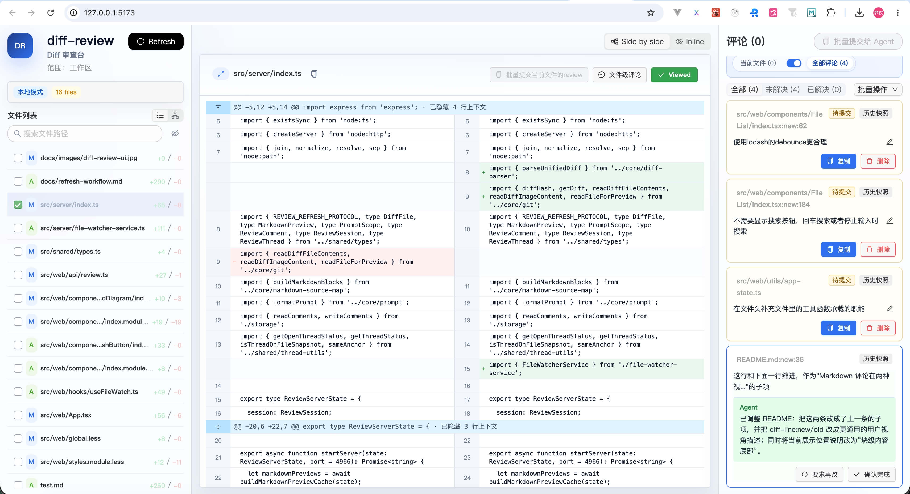

# diff-review



AI chat 里的本地代码审查工具。可以直接用 CLI 打开，也可以安装成 agent skill。

## Quick Start

Try it first:

```bash
npx --yes local-diff-reviewer
```

Install and use:

```bash
npm install -g local-diff-reviewer
local-diff-reviewer
```

Enable use from AI agents:

```bash
npx skills add Mone-Lee/diff-review
```

## 功能边界

- 查看当前工作区 diff、staged diff、指定 revision diff。
- 代码文件使用 GitHub 风格 unified diff。
- Markdown 文件只展示 Preview，不提供 Diff / Preview 切换。
- 支持文件级评论、代码行级评论、Markdown source line 评论。
- 支持 submit / replied / resolved 评论状态。
- 一条 thread 下可以包含多条 comment；同一锚点的新评论会追加到已有 thread。
- 支持通过内部 `--comment` 参数预置 agent findings / replies。
- 支持复制极简 AI prompt。

## CLI 使用方式

```bash
local-diff-reviewer
local-diff-reviewer staged
local-diff-reviewer HEAD~1 HEAD
```

这三种模式分别表示：

- `working`：审查当前工作区里尚未 `git add` 的改动。
- `staged`：审查已经 `git add`、但还没有提交的改动。
- `revision`：审查两个 revision 之间的差异，例如 `local-diff-reviewer HEAD~1 HEAD` 会比较 `HEAD~1..HEAD`。

## Skill 使用方式

在 AI chat 中使用：

```text
/diff-review
/diff-review staged
/diff-review HEAD~1 HEAD
```

安装 skill：

```bash
npx skills add Mone-Lee/diff-review
```

skill 会从目标 workspace 运行 `npx --yes local-diff-reviewer [args...]`。

### 预置 agent 评论

CLI 支持重复传入 `--comment <json>`，用于在打开 UI 前把 agent 审查结果写入评论存储。

代码 diff 行评论：

```bash
npx --yes local-diff-reviewer \
  --comment '{"type":"thread","filePath":"src/foo.ts","position":{"side":"new","line":36},"body":"这里没有处理空数组，可能导致运行时报错。"}'
```

Markdown source line 评论：

```bash
npx --yes local-diff-reviewer \
  --comment '{"type":"thread","filePath":"README.md","position":{"type":"markdown","line":22},"body":"这里可以补充 old/new side 的例子。"}'
```

文件级评论：

```bash
npx --yes local-diff-reviewer \
  --comment '{"type":"thread","filePath":"src/foo.ts","body":"这个文件的错误处理策略需要统一。"}'
```

回复已有 thread：

```bash
npx --yes local-diff-reviewer \
  --comment '{"type":"reply","threadId":"<thread-id>","body":"同意，这里应该按 repoRoot 隔离评论存储。"}'
```

`thread` 评论会以 `author: "agent"` 写入：如果同一锚点已经存在 thread，会作为新的 comment 追加进去；否则创建 replied thread。`reply` 会向目标 thread 追加一条 agent 回复并把状态切到 replied。为避免 agent finding 反复注入导致刷屏，同一 thread 内相同正文的 agent comment 会被视为重复并跳过。若路径不在当前 diff 中、行号无法定位或内容重复，脚本会跳过并在终端打印 warning。

当 agent 收到从 UI 复制出的 `[thread:<id>]` prompt 并完成处理后，应使用 `type: "reply"` 把处理结果写回原 thread，作为 `author: "agent"` 的 comment 保留在评论流里。回复内容应简要说明已修改什么，或说明为什么没有修改。

评论状态含义：

- `submit`：只有用户提交的评论，还没有 agent finding / reply。
- `replied`：已有 agent 内容，或从 resolved 重新打开。
- `resolved`：用户确认完成后的状态。

## 发布流程

```bash
npm run release
```

该命令会按顺序执行：

- `npm run release:check`
- `npm publish`
- `git push`
- `git push --tags`

只有在 `npm publish` 成功后，才会自动推送提交和标签到 GitHub。

## 本地开发

```bash
npm install
npm run dev
npm run typecheck
npm run build
```

`npm run dev`（等价于 `npm run review:dev`）会启动 API 服务并打开 Vite dev server，前端代码修改会使用 Vite HMR 热更新。`npm run review` 优先使用已构建的 `dist/web`。

仅调试前端时可使用：

```bash
npm run web:dev
```

注意：`web:dev` 只启动 Vite，不会启动 API 服务。

评论数据默认归档在 `~/.local/diff-review/logs`。Windows 下使用类似位置：
`%LOCALAPPDATA%\diff-review\logs`，如果未设置 `LOCALAPPDATA` 则退到
`~/AppData/Local/diff-review/logs`。
