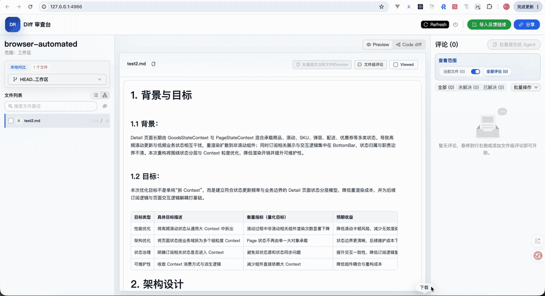

<h1 align="center">diff-review</h1>

<p align="center">
  <a href="https://nodejs.org/"></a>
  <a href="https://www.npmjs.com/package/local-diff-reviewer"></a>
  
</p>


AI 对话里的本地代码审查工具。用浏览器查看 Git diff、plan mode 内容、添加评论，再把评论作为 prompt 交给 AI 处理。  
可以直接用命令行打开，也可以安装成 agent skill。

## 快速开始

### 直接试用

```bash
npx --yes local-diff-reviewer@latest
```

### 安装 CLI

```bash
npm install -g local-diff-reviewer
local-diff-reviewer
```

### 安装 agent skill

默认只需要安装 skill。安装后即可在 AI 对话中使用 `/diff-review` 打开当前项目的审查台。

```bash
npx skills add Mone-Lee/diff-review
```

### 可选：启用 plan mode hook

`install-hooks` 不是必需步骤。只有希望 agent 在 plan mode 结束时自动打开计划审查台，才需要额外安装 plan mode hook：

```bash
npx --yes local-diff-reviewer@latest install-hooks
```

也可以用 shell 安装器合并 Codex hook 和配置：

```bash
curl -fsSL https://raw.githubusercontent.com/Mone-Lee/diff-review/master/scripts/install-hooks.sh | bash
```

plan mode hook 的完整流程见 [`docs/plan-mode-hooks.md`](docs/plan-mode-hooks.md)。

## 功能一览

> 从 Git diff 查看、多格式预览，到精细评论、分享协作和 Agent 反馈闭环，都在一个本地审查台中完成。

| 能力 | 支持内容 |
| --- | --- |
| 🔍 **Diff 审查** | 工作区、暂存区、指定版本；支持筛选部分文件 |
| 🧩 **多格式查看** | 代码、图片，以及 Markdown `Preview / Code diff` 双视图 |
| 💬 **精细评论** | 文件级、代码行级、Markdown 块级与源码行评论；支持文字选区的单行、跨行评论 |
| 🔄 **评论闭环** | 多轮回复、状态流转、评论定位，以及极简 AI prompt |
| 🔗 **分享协作** | 分享 Markdown 审查链接，并将他人评论同步回本地 |
| 🤖 **Agent 工作流** | 作为 Codex / Copilot / Qoder 的 plan mode hook，在执行前审查并退回意见 |

### 查看与定位

- 查看当前工作区 diff、暂存区 diff 或指定版本 diff，并可只选择部分文件预览。
- 代码文件使用 GitHub 风格 diff，支持并排与行内视图；图片文件支持直接比较。
- Markdown 文件可在渲染后的 `Preview` 与源码 `Code diff` 之间切换。

### 评论与协作

- 支持文件级评论、代码行级评论、Markdown 块级评论和 Markdown 源码行评论。
- 在 Markdown `Preview` 中按住 `Shift` 拖选文字，可针对单行或跨行选区添加评论。
- 一条评论线程可包含多条评论；同一锚点的新评论会继续追加到已有线程。
- 评论支持 `submit`、`replied`、`resolved` 三种状态，并可复制为交给 AI 处理的极简 prompt。

### 分享与 Agent 工作流

- 可分享 diff-review 链接给其他审阅者，并将对方的评论同步回本地审查台。
- 可作为 Codex / Copilot / Qoder 的 plan mode hook，在 Agent 执行前审查计划，并通过评论退回修改意见。

[](docs/images/share.mp4?raw=1)

动图可直接预览；点击可播放高清版本。

### 当前边界

- 分享功能仅支持 diff 中只有单个 Markdown 文件的场景，例如 Agent 上下文中只有一个文件，或 plan mode 产生的 Markdown 内容。
- Markdown `Code diff` 当前只支持并排视图，不支持行内视图。
- Markdown 评论会根据视图能力调整展示位置：
  - `Preview` 中的新评论按块级或文字选区锚定；`Code diff` 中可精确到源码行。
  - 从 `Code diff` 当前文本一侧创建的评论，会归并展示到对应的 Markdown 块；同一块内的多条评论目前会集中显示在块级内容底部。
  - 对于只存在于旧版本一侧的评论，`Preview` 无法精确展示；定位这类评论时会切换到 `Code diff`。

## CLI 使用方式

```bash
local-diff-reviewer
local-diff-reviewer staged
local-diff-reviewer HEAD~1 HEAD
local-diff-reviewer --new-session
local-diff-reviewer stop
local-diff-reviewer --repo /path/to/project
```

### 审查模式

- `working`：审查当前工作区里尚未 `git add` 的改动。
- `staged`：审查已经 `git add`、但还没有提交的改动。
- `revision`：审查两个版本之间的差异，例如 `local-diff-reviewer HEAD~1 HEAD` 会比较 `HEAD~1..HEAD`。

### 指定仓库

如果命令不是在目标项目目录里启动，可以用 `--repo <path>` 显式指定要审查的 Git 仓库：

```bash
local-diff-reviewer --repo /path/to/project
local-diff-reviewer --repo /path/to/project staged
```

### 停止审查

- `stop`：按当前 Git 仓库范围强制关闭该仓库启动过的审查运行进程（包含其 API 端口进程）；会先尝试优雅退出，超时后自动升级为强制终止。
- `stop` 是按仓库生效，不是全局关闭所有审查页面；如果本次审查实际使用的端口在 stop 后仍可访问，往往表示该端口已经被别的仓库复用，或当前仓库仍有页面未停干净。
- `stop` 成功时会等待相关 API/Vite 端口真正释放，而不只是等待进程收到退出信号。

```bash
local-diff-reviewer stop
local-diff-reviewer --repo /path/to/project stop
```

### 页面复用与快照

同一项目里再次执行 `local-diff-reviewer` 或 `/diff-review` 时，默认会复用仍在运行的审查页面和端口，并将该页面刷新为最新 diff。使用 `--new-session` 可以保留已有快照，再打开一个独立页面。不同项目的页面始终分别绑定各自的项目，不会被最后一次启动覆盖。首次启动默认优先使用 `127.0.0.1:4966`；独立页面或其他项目遇到端口占用时会自动选择空闲端口。

```text
项目 A /diff-review -> http://127.0.0.1:4966  -> 项目 A diff
项目 A /diff-review -> http://127.0.0.1:4966  -> 刷新为项目 A 最新 diff
项目 A /diff-review --new-session -> http://127.0.0.1:<空闲端口> -> 项目 A 独立快照
项目 B /diff-review -> http://127.0.0.1:<空闲端口> -> 项目 B diff
```

页面打开后，代码 diff 与 Markdown 的 `Preview / Code diff` 视图都会固定为当前审查快照；工作区继续变动不会自行改写页面内容。再次执行 `local-diff-reviewer` 或 `/diff-review` 会让默认页面自动同步到新快照；使用 `--new-session` 打开的独立页面继续保留旧快照。评论线程与其创建时的 diff 快照绑定：旧线程会在评论侧栏中保留并标记为历史快照，但不会因另一份快照中恰好有相同行号而贴到错误代码上。

评论、快照、代码行之间的绑定关系及页面更新判断详见
[`docs/comment-snapshot-binding.md`](docs/comment-snapshot-binding.md)。

## Plan mode hook

plan mode hook 独立于上面的三种审查模式：它审查的是 agent 生成的计划，而不是 Git diff。

agent 产出计划后，计划会作为 Markdown 打开到本地审查台。你可以在计划上添加评论并“退回评论”，让 agent 继续修改；也可以“通过计划”。受 Codex 当前 hook 能力限制，通过后仍需回到 Codex 点击原生 “Yes, implement this plan” 才会进入实施。

支持 Codex、Copilot 和 Qoder。安装命令见[快速开始](#可选启用-plan-mode-hook)；项目级安装、Copilot / Qoder 配置和完整流程见 [`docs/plan-mode-hooks.md`](docs/plan-mode-hooks.md)。

## Skill 使用方式

在 AI 对话中使用：

```text
/diff-review
/diff-review staged
/diff-review HEAD~1 HEAD
/diff-review --new-session
/diff-review stop
```

安装 skill：

```bash
npx skills add Mone-Lee/diff-review
```

## 评论与 AI prompt

在审查页面中复制评论后，会得到只包含线程标识、定位信息和评论内容的 prompt。把它交给已加载 diff-review Skill 的 agent，agent 会处理评论并把结果回写到原线程。

从界面复制出的 prompt 示例：

```text
[thread:33fdc4a2-3cfa-419f-9aa4-b1ae4f662241]
test.md:41
markdown评论

[thread:4f053318-5922-45d0-99e2-377071942422]
test.md:new:37
new行内评论

[thread:82546c3b-52b5-42be-9358-c685b2ad1693]
test.md:old:57
old行内评论

[thread:86fca351-f2c7-4d41-810c-f810fe066ca4]
src/core/prompt.ts
文件级评论
```

评论状态含义：

- `submit`：只有用户提交的评论，还没有 agent 发现或回复。
- `replied`：已有 agent 内容，或从 `resolved` 重新打开。
- `resolved`：用户确认完成后的状态。

## 评论数据存储

评论数据默认归档在 `~/.local/diff-review/logs`。  
Windows 下使用类似位置：
`%LOCALAPPDATA%\diff-review\logs`，如果未设置 `LOCALAPPDATA` 则退到
`~/AppData/Local/diff-review/logs`。
