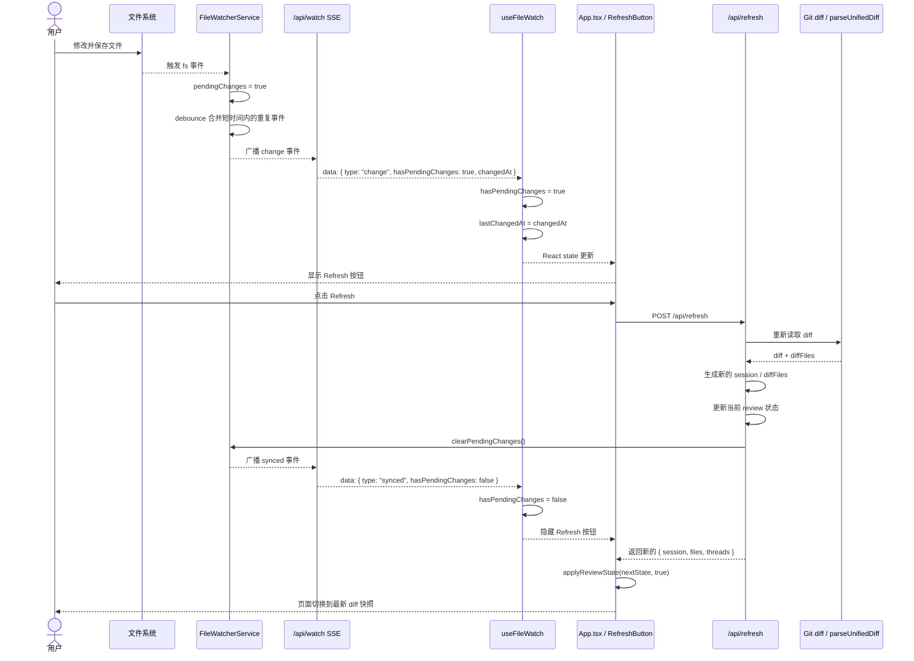

# Refresh 机制说明

本文描述 review 页面中 `Refresh` 功能的实现原理：仓库文件变化如何被检测、前端如何收到
“可刷新”信号，以及用户点击 `Refresh` 后页面如何切换到新的 diff 快照。文档以当前工作区
实现为准。

## 目标

这套机制要同时满足两个要求：

1. 当项目文件继续变化时，页面要及时感知到“当前展示的 diff 可能过期了”。
2. 页面不能因为用户正在阅读或评论时出现新的文件变化，就自动跳到另一份 diff 快照。

因此当前设计采用“两段式刷新”：

- 第一段：服务端监听文件变化，并通过 SSE 通知前端“现在可以刷新了”。
- 第二段：只有用户手动点击 `Refresh`，服务端才重新计算最新 diff，并替换当前快照。

## 核心思路

### 1. 文件变化不直接替换当前 diff

服务端的文件监听只负责把状态标记为“有待刷新变更”，不会直接改动：

- 当前 `session`
- 当前 `diffFiles`
- 当前 Markdown 预览缓存

这样可以保证用户正在看的内容、当前选中的文件和行内评论不会因为磁盘变化自动跳动。

### 2. Refresh 才重新生成新快照

真正切换到新 diff 的动作集中在 `POST /api/refresh`：

1. 按当前 `session.mode` 重新读取仓库 diff。
2. 重新执行 `parseUnifiedDiff(diff)`。
3. 生成一个新的 `ReviewSession`。
4. 重建 Markdown 预览缓存。
5. 返回新的 `{ session, files, threads }` 给前端。

前端拿到这个新状态后，再按“强制切换快照”的方式替换当前视图。

## 服务端实现

### FileWatcherService：只广播“可刷新”信号

文件监听逻辑位于 `src/server/file-watcher-service.ts`。

它的职责很单一：

- 监听仓库文件变化。
- 维护 `pendingChanges` 状态。
- 通过 SSE 把 `change` / `synced` 事件推给前端。

核心状态如下：

```ts
private pendingChanges = false;
private readonly clients = new Set<Response>();
```

当监听到磁盘事件时，服务端不会立刻刷新 diff，而是只做两件事：

1. 把 `pendingChanges` 设为 `true`
2. 在短暂 debounce 后广播：

```ts
{
  type: 'change',
  hasPendingChanges: true,
  changedAt: new Date().toISOString()
}
```

这里加 debounce 是为了避免保存文件、格式化、生成产物等连续写盘导致按钮频繁闪动。

### 文件变化到底是怎么监听到的

这里的“监听文件变化”不是 Git 主动通知前端，也不是前端自己去扫描文件，而是 Node 服务端
直接使用 `node:fs` 提供的 `watch()` 能力：

```ts
import { watch } from 'node:fs';
```

可以把它理解成：

- 服务端向操作系统注册一个“文件变化观察者”
- 之后仓库目录里一旦出现写入、重命名、替换等文件系统事件
- 操作系统就回调给当前 Node 进程
- Node 再把这个低层事件翻译成项目里的 `change` SSE 事件

也就是说，真正最先知道“文件变了”的并不是浏览器，而是运行中的本地 Node 服务。

### 当前项目监听了哪些位置

`FileWatcherService.startWatching()` 当前策略是：

```ts
if (this.tryWatch(this.repoRoot, { recursive: true })) {
  return;
}

this.tryWatch(this.repoRoot);
this.tryWatch(`${this.repoRoot}/.git`);
```

它分成两层：

#### 优先方案：递归监听整个仓库目录

如果当前运行环境支持递归监听，就直接监听：

- `repoRoot`

并开启：

- `{ recursive: true }`

这意味着仓库根目录下的子目录、子文件变化，都会尽量通过同一个 watcher 收到。

对这个项目来说，这是最理想的情况，因为：

- 改 `src/` 下的源码能收到
- 改 `docs/` 下的文档能收到
- 新增文件、删除文件、重命名文件也更容易被覆盖到

#### 回退方案：分别监听仓库根目录和 `.git`

有些平台或运行环境对递归监听支持有限，所以实现里做了回退：

- 监听 `repoRoot`
- 再额外监听 `${repoRoot}/.git`

这样做的原因是：

1. 工作区里的直接文件变化，很多时候能通过根目录监听到
2. Git 索引、HEAD、某些内部状态变化，经常会落在 `.git` 目录中

因此即使递归监听不可用，也尽量让这两类变化都能触发“可以刷新”的提示。

### 监听到的是“文件系统事件”，不是“精确 diff 变化”

这一点很重要。

`fs.watch()` 收到的是底层文件系统事件，它只能说明：

- 某个被监听范围里发生了变化

它并不知道：

- 这次变化是否真的进入了最终 Git diff
- 变化的是源码、文档、临时文件还是生成产物
- 当前 review 模式下这次变化是否会影响最终页面展示

所以 `FileWatcherService` 的职责非常克制：

- 它不试图判断“这次变化值不值得刷新”
- 它只负责发出“仓库可能变了，你可以刷新”的信号

真正要不要更新页面，仍然交给用户点击 `Refresh` 后，通过 `getDiff(...)` 再正式计算一次。

### 为什么监听层不直接调用 `getDiff()`

表面上看，文件一变就直接重新跑一次 diff，似乎也能工作；但当前设计故意没有这么做。

主要原因有三个：

1. 文件变化可能很频繁
   - 输入中自动保存
   - formatter 连续写盘
   - 构建工具更新多个文件
2. 重新计算 diff 的代价比接收一个 fs 事件高得多
3. 自动替换当前快照会打断用户阅读和评论

所以系统把这两层拆开：

- 监听层：轻量、快速、只负责提示
- 刷新层：显式、昂贵、真正重建快照

### 一个实际例子

假设你正在看 review 页面，同时编辑 `docs/refresh-workflow.md`：

1. 编辑器保存文件
2. 操作系统向 Node 进程报告一次文件系统变化
3. `watch(repoRoot, ...)` 的回调被触发
4. `FileWatcherService.handleChange()` 把 `pendingChanges` 设为 `true`
5. debounce 结束后，服务端发出一条 `change` SSE
6. 前端显示 `Refresh` 按钮

但此时系统仍然不知道：

- 这次变更是不是最终 Git diff 的一部分
- 有没有别的文件也一起变了
- 当前用户是否正好在读某段内容，不适合自动跳屏

所以页面只是提示，而不是直接切换。

### `/api/watch`：SSE 持续推送变更事件

SSE 入口位于 `src/server/index.ts`：

```ts
app.get('/api/watch', (_req, res) => {
  res.writeHead(200, {
    'Content-Type': 'text/event-stream',
    'Cache-Control': 'no-cache, no-transform',
    Connection: 'keep-alive'
  });
  res.write(': connected\n\n');
  fileWatcher.subscribe(res);
});
```

如果你之前没有接触过 SSE，可以先把它理解成：

- 前端先发起一次普通 HTTP 请求
- 但服务端不立刻结束这个请求
- 而是把连接一直保持打开
- 以后每当有新事件，就沿着这条已经打开的连接继续往前端写数据

也就是说，SSE 并不是“很多次请求”，而是“一次请求，很多次推送”。

这个接口和普通 `fetch` 不同：

- 普通接口：请求一次，返回一次，连接结束
- SSE：请求建立后连接保持打开，服务端后续可以持续 `res.write(...)`

前端因此可以一直收到：

- `connected`
- `change`
- `synced`

这些事件，而不需要轮询一个“是否变更”的查询接口。

### SSE 到底是什么

SSE 的全称是 `Server-Sent Events`，直译就是“服务端发送事件”。

它解决的问题很具体：

- 前端希望及时收到服务端的新消息
- 但这些消息不是前端主动点按钮才产生的
- 也不值得为此引入双向通信的 WebSocket

在这个项目里，“仓库文件发生变化”就属于这种场景：

- 变化发生在磁盘和服务端监听器这一侧
- 前端本身并不知道什么时候会变
- 如果靠 `setInterval(fetch('/api/xxx'))` 轮询，虽然也能实现，但会不断重复发请求

SSE 正适合这种“服务端单向通知前端”的场景。

当前项目里，前端只需要知道：

- “有没有新变化”
- “变化大概是什么时候发生的”

并不需要把消息再双向发回同一条长连接，所以 SSE 比 WebSocket 更简单。

### 为什么这里用 SSE，而不是轮询或 WebSocket

可以把三种方案简单对比如下：

| 方案 | 工作方式 | 适不适合这里 |
| --- | --- | --- |
| 轮询 | 前端每隔 N 秒请求一次“有变化吗” | 能用，但会产生很多空请求 |
| SSE | 前端建立一个长连接，服务端有变化时主动推送 | 很适合 |
| WebSocket | 建立双向长连接，前后端都能随时发消息 | 功能更强，但这里偏重 |

当前场景里：

1. 事件来源主要在服务端
2. 前端只需要被动接收通知
3. 事件模型很简单，只是几个状态事件

所以 SSE 的复杂度最低，语义也最贴合。

### SSE 响应内容长什么样

SSE 不是返回一个完整 JSON 数组，而是不断往响应体里追加一段一段的文本。

它最常见的格式像这样：

```text
data: {"type":"change","hasPendingChanges":true,"changedAt":"2026-06-20T10:00:00.000Z"}

data: {"type":"synced","hasPendingChanges":false}

```

这里有几个关键点：

- 每条消息通常以 `data: ` 开头
- 一条消息结束时要以空行分隔
- 浏览器的 `EventSource` 会自动把这段文本解析成一条消息
- 前端收到后通过 `event.data` 拿到 `data:` 后面的字符串

所以在服务端代码里你会看到：

```ts
res.write(`data: ${JSON.stringify(event)}\n\n`);
```

这个 `\n\n` 很重要，它表示“一条 SSE 消息结束了，可以交给前端处理了”。

### 当前项目里的 SSE 连接生命周期

在这个项目里，一次 SSE 连接的生命周期大致如下：

1. React 页面挂载
2. `useFileWatch()` 创建 `new EventSource('/api/watch')`
3. 浏览器向服务端发起 `GET /api/watch`
4. 服务端返回 `Content-Type: text/event-stream`
5. 这条连接保持打开
6. 文件变化时，服务端调用 `res.write(...)` 推送事件
7. 页面卸载时，前端执行 `source.close()`

因此，`/api/watch` 不是“调用一次拿结果”，而是“订阅一个持续存在的事件源”。

### `connected` / `change` / `synced` 分别表示什么

当前项目里定义了三种事件：

#### `connected`

含义是：“前端刚连上事件流，现在先把当前状态告诉你。”

例如：

```json
{ "type": "connected", "hasPendingChanges": false }
```

这个事件的作用是做初始化同步，避免前端刚连上时不知道当前是否已经有待刷新变更。

#### `change`

含义是：“服务端监听到仓库文件变化了，现在页面可以提示用户刷新。”

例如：

```json
{
  "type": "change",
  "hasPendingChanges": true,
  "changedAt": "2026-06-20T10:00:00.000Z"
}
```

收到它以后，前端通常只做 UI 状态更新：

- 显示 `Refresh` 按钮
- 记录最近一次变化时间

它不会直接替换当前 diff 快照。

#### `synced`

含义是：“当前页面刚刚已经刷新到最新快照，待刷新状态可以清除了。”

例如：

```json
{ "type": "synced", "hasPendingChanges": false }
```

收到它以后，前端会把 `hasPendingChanges` 设回 `false`，让 `Refresh` 按钮消失。

### 为什么服务端要保存一组 `Response`

在 `FileWatcherService` 里有这样一个状态：

```ts
private readonly clients = new Set<Response>();
```

这是因为一个 review 页面可能不止一个浏览器标签页在看。

每个打开着的页面，都会有自己的一条 `/api/watch` 长连接；服务端需要记住这些仍然活着的连接，
这样文件变化发生时，才能把同一条事件广播给所有页面。

所以 `clients` 可以理解成：

- “当前所有正在订阅 `/api/watch` 的前端连接”

当浏览器页面关闭或切走导致连接断开时，服务端会把对应的 `Response` 从集合里移除。

### 为什么还要 debounce

文件系统变化通常不是“只触发一次”。

举几个常见例子：

- 编辑器保存时可能先写临时文件，再替换正式文件
- formatter 会在一次保存里连续改多行甚至多次写盘
- 某些工具会同时改源码和产物文件

如果每次文件系统事件都立刻推送一个 `change`，前端就会在很短时间收到很多次重复通知。

所以当前实现会先：

1. 立刻把内部状态设为 `pendingChanges = true`
2. 但把真正的 SSE 推送稍微延后一点
3. 如果这期间又来了新事件，就合并成一次通知

这就是 debounce 的作用：把“很多很密集的底层文件事件”收敛成“用户视角下的一次仓库变化”。

### `/api/refresh`：手动重算最新 diff

真正的刷新入口也是在 `src/server/index.ts`：

```ts
app.post('/api/refresh', async (_req, res, next) => {
  const nextReviewState = await rebuildReviewState(state);
  markdownPreviews = await buildMarkdownPreviewCache(nextReviewState);
  applyReviewState(state, nextReviewState);
  fileWatcher.clearPendingChanges();
  const comments = await readComments(state.session.repoRoot);
  res.json({ session: state.session, files: state.diffFiles, threads: comments.threads });
});
```

这里做了三件关键事情：

1. 生成新的 review 快照
2. 用新快照替换服务端内存中的当前状态
3. 调用 `fileWatcher.clearPendingChanges()`，把前端按钮恢复为“已同步”

### `rebuildReviewState()`：按当前模式重建快照

服务端把“如何从仓库重建一份新快照”收敛到一个函数里：

```ts
const diff = await getDiff(state.session.mode, state.session.repoRoot);
const diffFiles = parseUnifiedDiff(diff);

const session: ReviewSession = {
  id: crypto.randomUUID(),
  repoName: state.session.repoName,
  repoRoot: state.session.repoRoot,
  mode: state.session.mode,
  diffHash: diffHash(diff),
  createdAt: new Date().toISOString()
};
```

这里有一个重要点：`Refresh` 并不改变 review 范围，只复用当前 `session.mode`。

也就是说：

- working review 刷新后还是 working
- staged review 刷新后还是 staged
- revision review 刷新后还是同一组 base/target

## 前端实现

### `useFileWatch()`：把 SSE 收敛成页面状态

前端监听逻辑位于 `src/web/hooks/useFileWatch.ts`。

它创建：

```ts
const source = new EventSource('/api/watch');
```

这里的 `EventSource` 是浏览器原生提供的 Web API，不是 Node 内置对象。

它帮前端做了几件事：

- 发起 `GET /api/watch`
- 自动把响应识别成 SSE 事件流
- 每收到一条 `data: ...` 消息，就触发一次 `onmessage`
- 连接异常断开时，会尝试自动重连

并把服务端事件收敛成两个前端状态：

- `hasPendingChanges`
- `lastChangedAt`

也就是说，页面其他组件不需要直接理解 SSE，只需要消费：

```ts
{
  hasPendingChanges,
  lastChangedAt,
  clearPendingChanges()
}
```

如果把这层 Hook 拿掉，让页面组件直接操作 `EventSource`，那 `App.tsx` 就得自己处理：

- 建立连接
- 解析 `event.data`
- 判断不同 `type`
- 管理关闭连接
- 把事件翻译成页面状态

现在把这些细节放进 `useFileWatch()`，页面层就只关心“有没有待刷新变化”这个业务结果。

### `useFileWatch()` 收到消息时具体做了什么

逻辑可以概括成：

1. 收到 `connected`
   - 读取当前 `hasPendingChanges`
   - 如果当前没有待刷新变化，则清空 `lastChangedAt`
2. 收到 `change`
   - 把 `hasPendingChanges` 设为 `true`
   - 记录 `changedAt`
3. 收到 `synced`
   - 把 `hasPendingChanges` 设为 `false`
   - 清空 `lastChangedAt`

也就是说，SSE 在前端并没有直接操作界面，而是先落成普通 React state，再由按钮组件决定要不要显示。

### 一次真实刷新流程图

如果把一次“用户保存文件后，页面出现 `Refresh` 按钮，再点击刷新”的过程展开，可以把它理解成下面这张流程图：



你可以把这张图拆成两个阶段来看：

1. `change` 阶段
   - 目标只是告诉前端“内容可能过期了”
   - 不切换当前 diff
2. `refresh` 阶段
   - 目标是重新计算并替换当前快照
   - 这一步一定要用户手动确认

这也是整个实现里最关键的设计点：

- SSE 负责“通知”
- `/api/refresh` 负责“真正更新内容”

### `RefreshButton`：只在有待刷新变更时出现

按钮组件位于 `src/web/components/RefreshButton/index.tsx`。

当前策略是：

- `hasPendingChanges === false` 时不渲染按钮
- `hasPendingChanges === true` 时显示提示文案和 `Refresh` 按钮

因此页面不会一直常驻一个无意义的刷新按钮，而是在确实出现新文件变化后才提示用户。

### `App.tsx`：把“检测变化”和“切换快照”串起来

页面主流程位于 `src/web/App.tsx`。

文件变化检测来自：

```ts
const { clearPendingChanges, hasPendingChanges, lastChangedAt } = useFileWatch();
```

点击刷新后的动作是：

```ts
const nextState = await refreshReviewSnapshot();
applyReviewState(nextState, true);
clearPendingChanges();
```

这里有两个关键点：

#### `refreshReviewSnapshot()`

它调用 `POST /api/refresh`，拿回服务端刚刚重算出的新快照。

#### `applyReviewState(nextState, true)`

第二个参数传 `true`，表示这次不是普通的状态同步，而是“强制把内容区切到新快照”。

因此前端会更新：

- `session`
- `files`
- `selectedPath`
- `threads`

如果原来选中的文件已经不在新 diff 里，会自动回退到新文件列表的第一个文件。

## 为什么不直接用现有轮询刷新 diff

当前页面本来就有 `refreshReviewState()` 轮询 `/api/review-state`，但它默认只做“状态同步”，
并不会主动去仓库重新计算一份新 diff。

原因是：

- `/api/review-state` 读取的是服务端当前内存中的快照
- 这份快照只有在 CLI 刷新 runtime 或 `POST /api/refresh` 后才会变化

所以要实现“本地文件继续改了，页面能自己刷新到新 diff”，必须额外补两层能力：

1. 一个能感知文件变化的 watch 通道
2. 一个能主动重算当前仓库 diff 的 refresh 接口

## 与评论快照绑定规则的关系

`Refresh` 生成的是一份新的 `session + diffFiles` 快照，因此会自然触发当前项目既有的
评论展示规则：

- 侧栏仍展示全部历史 thread
- 内容区只挂载属于当前 `fileSnapshotHash` 的 thread

这意味着刷新之后：

1. 新快照对应的评论可以继续行内展示
2. 旧快照评论不会错误贴到新代码旁边
3. 历史讨论仍保留在右侧评论栏中

所以 `Refresh` 实际上只是“把页面切到新的快照”，而不是“迁移旧评论到新代码”。

## 整体时序

完整流程可以表示为：

```text
用户修改文件
  -> FileWatcherService 收到 fs 事件
  -> 服务端把 pendingChanges 标为 true
  -> /api/watch 通过 SSE 推送 change
  -> useFileWatch() 把页面状态设为 hasPendingChanges = true
  -> 页面显示 Refresh 按钮

用户点击 Refresh
  -> 前端 POST /api/refresh
  -> 服务端重新读取 diff 并生成新的 session / diffFiles
  -> 服务端更新当前 review 状态并清除 pendingChanges
  -> 服务端返回新的 review-state
  -> 前端 applyReviewState(nextState, true)
  -> 内容区切换到新的 diff 快照
```

## 总结

当前 `Refresh` 机制的核心不是“自动刷新 diff”，而是“自动检测变化 + 手动确认切换快照”。

这样做的好处是：

- 用户能知道页面内容已经过期
- 用户不会因为后台文件变化被强制打断阅读
- 刷新后仍能继续复用现有的评论快照隔离规则

整体上，它把“仓库状态变化”和“界面快照切换”解耦了：前者自动感知，后者由用户决定。
