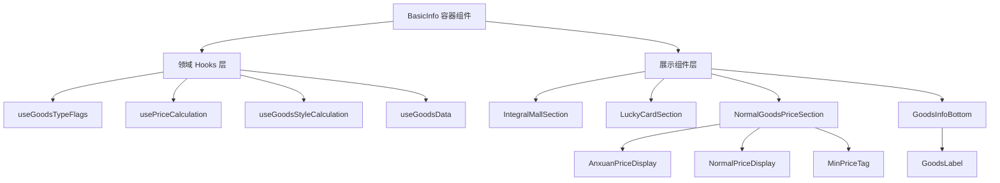

# 小程序商城域

## 变更记录

| 版本(Git) | 日期 | 变更类型 | 变更内容 | Commit |
|-----------|------|----------|----------|--------|
| 1e5ae07463 | 2026-05-14 | 更新 | 补齐商品详情页文档：将《商品详情流程》改为函数块级别引用，并新增会员/非会员、价格、Context、切店、参数、分享、商品状态等补充说明 | 1e5ae07463 |
| cf5c6baadfb | 2026-05-13 | 更新 | 新增直播粉丝团文档：覆盖 `FansClubItem` 工具区入口、`shouldMountFanClubPopup` 挂载条件、`FanClubPopup` 按 `isFans` 分流加入/详情弹窗、`joinFansGroup` 加入粉丝团、`getFansSimpleInfo` 刷新全局粉丝信息、`FANS_CHANGE_PRIVATE` 等级提升 IM、`getFansDetail` 详情刷新、任务分发（评论/小绿车/分享/福卡兑换）、`claimJoinReward` 奖励领取、优惠券/福卡查看跳转、`funClubFuCard` / `fuCardIntimacy` / `exchangeIntimacyWithFuCard` 福卡兑换亲密度、`getFansBenefit` 等级权益和定时抽奖任务联动，新建《直播粉丝团流程》与《直播粉丝团规则》 | cf5c6baadfb |
| cf5c6baadfb | 2026-05-13 | 更新 | 新增直播流播放器文档：覆盖 `PlayerBox` 主体播放器、封面与横竖屏样式、`setPlayUrls` / `initPlayUrl` 拉流地址初始化、`getLivePullFormat` 协议选择、`LivePlayer` 原生播放器封装、播放状态码 `2004` / `-2003` / `-2301` / `-2302`、最多 5 次清空/恢复 `playUrl` 重试、首帧耗时日志、网络质量与 WebRTC 自适应码率、多机位切换、清晰度切换、溯源直播声音控制、后台音频播放、小窗事件和双击点赞联动，新建《直播流播放器流程》与《直播流播放器规则》 | cf5c6baadfb |
| cf5c6baadfb | 2026-05-13 | 更新 | 新增直播小绿车文档：覆盖 `GoodsEntry` 小绿车入口、`GoodsListModal` 商品列表弹窗、`liveExtraInfo.statisticInfo.liveGoodsCount` 初始化、`LIVE_GOODS_COUNT` 角标更新、`EXPLAIN_GOODS` / `HOT_SALES` 讲解与热卖联动、`GOODS_LIST_MODAL_OPEN` / `GOODS_LIST_MODAL_ADD_CART` 工具事件、分类筛选、搜索分页、讲解商品置顶、优惠券数量与自动领券、会员推广卡、`LiveGoodsCard` 加购/购买/商详/赠品操作和低端机/搜索页加购动画边界，新建《直播小绿车流程》与《直播小绿车规则》 | cf5c6baadfb |
| cf5c6baadfb | 2026-05-12 | 更新 | 新增直播讲解卡片文档：覆盖 `CurrentSayGoodsItem` 右下角讲解商品入口、`liveExtraInfo.sayingGoodsInfo` 初始化、`EXPLAIN_GOODS` / `EXPLAIN_GOODS_CLOUD` 讲解消息、`HOT_SALES` / `HOT_SALES_CLOUD` 热卖消息、安选公开直播身份分流、`buildSayingsData*` 数据构建、`delayShow` 延迟展示、热卖 `spuId` 防串、`CurrentSayGoods` 价格/倒计时/热卖标签、半屏商详和 SKU 面板事件，新建《直播讲解卡片流程》与《直播讲解卡片规则》 | cf5c6baadfb |
| cf5c6baadfb | 2026-05-12 | 更新 | 新增直播评论区文档：覆盖 `BottomLeftBlock` 底部左侧区块入口、五个子模块装配（公屏上墙/悬浮弹幕/分享引导/消息列表/快捷回复）、`showMessageModule` 展示条件、IM 消息缓存与 1 秒批量刷新、原生 `<message-list>` 渲染、气氛消息轮播、MD5 高亮聚合评论算法、管理员上墙/复制/回复、60 秒分享引导和快捷回复事件，新建《直播评论区流程》与《直播评论区规则》 | cf5c6baadfb |
| cf5c6baadfb | 2026-05-12 | 更新 | 新增直播福袋与直播邀请有礼营销活动：福袋覆盖 `LuckyBagItem` 入口、`liveExtraInfo.luckyBagInfo` 初始化、IM 数量增长、10 秒惊喜福袋检查、`liveUserLuckyBagList` 列表、`getLiveLuckyCoupon` 一键领取、五类福袋门槛（无门槛/关注/分享/邀请/ONE_CLICK 合成态）、`getLuckyCoupon` 领券和券使用链路；邀请有礼覆盖 `InviteRewardItem` 入口、`InviteRewardWrapper` 弹窗、`getActiveInviteInfoV2` 详情、两类邀请模式（Share/ShareAndWatch）、单聊完成消息、奖励卡按钮分流、优惠券/实物/积分/福卡后续动作，新建四篇流程与规则文档 | cf5c6baadfb |
| cf5c6baadfb | 2026-05-12 | 更新 | 新增直播发福卡营销活动：覆盖 `FuCardItem` 福卡入口与 `LuckyDrawItem` 拼手气入口边界、`activityType=luckyCard` 共享 `LuckyDraw` 壳子、福卡挂件展示条件、`getActiveWheelLottery` 中 `res.fuCard` 状态来源、V1 广播专属处理、倒计时/立即开奖、`getLotteryPrizeList` 开奖接口、未中奖静默跳过、IM 断线补偿、福卡规则页和 `LuckyCard` 结果卡领取能力，新建《直播发福卡活动流程》与《直播发福卡活动规则》 | cf5c6baadfb |
| cf5c6baadfb | 2026-05-12 | 更新 | 新增直播间红包雨营销活动：覆盖挂件入口（`RedPacketItem` → `RedPacketWrapper`）、多场次聚合（`userPartIds + multiRedPacketRainData + RedPacketRainSwiper`）、活动状态来源（`updateRedPacketState` + `updateRepeatMessageConfig`）、预告弹窗与三种门槛（`RedPacketRainActivityThreshold`：Unrestricted/FollowedAnchorUser/OnlyShare）、订阅授权链路（`createRedPacketActivitySubscribe` + `redPacketRainRaffleRemind`）、11 个动画层常量（`RAIN_DURATION=15s` / `PACKET_INTERVAL=300` / `FALL_DURATION=3s` / `MAX_METEORS=6` 等）、随机延迟 500~5500ms 抽奖、`redPacketRainLotteryPrize` 开奖三分支（`isPrize=1` 轮询 / `awaitMills>0` 延迟递归 / 未中奖）、`pollPrizeInfo` 错误码 `05013` 2s × 最多 5 次轮询、`RedPacketWinningType` 四类结果分流（Goods/Coupon/Integral/NotWon）+ 门店核销、分享回调 `getRedPacketRainShare`、主播/推流侧 `RedPacketEndType` 复用，新建《直播红包雨活动流程》与《直播红包雨活动规则》 | cf5c6baadfb |
| cf5c6baadfb | 2026-05-12 | 更新 | 新增直播间定时抽奖营销活动：覆盖挂件入口（`TimedLotteryItem`）、场次型状态来源（聚合接口+群广播+单聊+开奖回写+IM 补偿）、详情/任务预取、7 种任务类型（Any/Follow/Share/Comment/PlaceOrder/JoinFansClub/FanClubLevel）、`LIVE_ACTIVE_TASK_COMPUTED_EVENT` 任务完成感知、参与人数 10s 轮询、倒计时/立即开奖触发、`getLotteryPrizeListV2` 随机延迟+最大重试轮询、结果弹窗按钮分流（未中奖/Pending/Expired/Goods+RedeemOnline）、手动领取与物流、前后台切换刷新、关键常量与异常（`timed_lottery_get_prize_info_error/retry_fail/task_rule_parse_error/manual_receive_prize_error/distribution_time_end`），新建《直播定时抽奖活动流程》与《直播定时抽奖活动规则》 | cf5c6baadfb |
| cf5c6baadfb | 2026-05-12 | 更新 | 新增直播间大转盘营销活动：覆盖挂件入口、抽奖次数三路来源、扇区生成、任务体系、心跳上报、结果弹窗奖品分流与私域门店核销边界；补全观看有礼营销活动任务包版：新增活动形式运行时分流（task_reward/task_package_reward）、任务包任务类型（观看/评论/福卡/签到）、商户转账领取链路、单聊广播驱动、挂机联动暂停，并同步扩展《直播观看有礼活动流程》与新建《直播观看有礼活动规则》 | cf5c6baadfb |
| 1216a7c38a4 | 2026-05-09 | 更新 | 新增福利商城(BenefitMall)模块：积分签到、积分兑换、福卡兑换三大功能；新增购物车价格显示规则：会员价/团批价展示逻辑，8种购物车类型；新增首页本地生活(LocalLife)资源位支持；更新直播间安选店权限检查和位置确认流程；更新分享弹窗懒加载重构 | 1216a7c38a4 |

## 概述

蜂群商城（fq-mall）是一个基于 Taro + React + Redux 的多端小程序电商解决方案。

### 业务定位

- 面向微信小程序的电商与社交电商场景
- 支撑直播带货、社群拼团、线下店等多形态业务
- 提供完善的营销活动与数据分析能力，助力运营增长

### 核心能力

| 能力 | 说明 |
|------|------|
| 电商核心 | 商品管理、购物车、订单管理、用户中心 |
| 社交电商 | 直播带货、拼团/社区团购 |
| 营销活动 | 优惠券、积分、会员等级、活动中心 |
| 消息通知 | 站内信、订阅消息、互动消息、平台公告 |
| 福利商城 | 积分签到、积分兑换、福卡兑换 |
| 数据分析 | 销售分析、用户行为分析、实时监控 |

### 技术架构

- **多端框架**：Taro 3.6.35 支持微信小程序等多端
- **视图层**：React 18.2 + TypeScript 5.1
- **状态管理**：Redux 4.2 + 自研 hRedux/hGlobal 封装
- **构建工具**：Webpack 5.78 + 自研插件（分包异步化、尺寸适配、性能面板）
- **监控体系**：Aegis SDK 性能与错误监控 + hReport 上报 + hRum 监控
- **调试工具**：PageSpy 远程调试、QuickTracking 埋点

#### 2.2.1 组件分层架构



---

## 相关流程

| 流程 | 文档路径 |
|------|----------|
| 首页加载流程 | [首页加载流程](../flow/mall/首页加载流程.md) |
| 商品详情流程 | [商品详情流程](../flow/mall/商品详情流程.md) |
| 商品搜索流程 | [商品搜索流程](../flow/mall/商品搜索流程.md) |
| 加购流程 | [加购流程](../flow/mall/加购流程.md) |
| 购物车结算流程 | [购物车结算流程](../flow/mall/购物车结算流程.md) |
| 订单创建流程 | [订单创建流程](../flow/mall/订单创建流程.md) |
| 订单支付流程 | [订单支付流程](../flow/mall/订单支付流程.md) |
| 订单退款流程 | [订单退款流程](../flow/mall/订单退款流程.md) |
| 直播带货流程 | [直播带货流程](../flow/mall/直播带货流程.md) |
| 直播讲解卡片流程 | [直播讲解卡片流程](../flow/mall/直播讲解卡片流程.md) |
| 直播小绿车流程 | [直播小绿车流程](../flow/mall/直播小绿车流程.md) |
| 直播评论区流程 | [直播评论区流程](../flow/mall/直播评论区流程.md) |
| 直播红包流程 | [直播红包流程](../flow/mall/直播红包流程.md) |
| 直播幸运袋流程 | [直播幸运袋流程](../flow/mall/直播幸运袋流程.md) |
| 直播观看有礼活动流程 | [直播观看有礼活动流程](../flow/mall/直播观看有礼活动流程.md) |
| 直播邀请有礼活动流程 | [直播邀请有礼活动流程](../flow/mall/直播邀请有礼活动流程.md) |
| 直播大转盘活动流程 | [直播大转盘活动流程](../flow/mall/直播大转盘活动流程.md) |
| 直播定时抽奖活动流程 | [直播定时抽奖活动流程](../flow/mall/直播定时抽奖活动流程.md) |
| 直播发福卡活动流程 | [直播发福卡活动流程](../flow/mall/直播发福卡活动流程.md) |
| 直播红包雨活动流程 | [直播红包雨活动流程](../flow/mall/直播红包雨活动流程.md) |
| 直播福袋活动流程 | [直播福袋活动流程](../flow/mall/直播福袋活动流程.md) |
| 拼团流程 | [拼团流程](../flow/mall/拼团流程.md) |
| 送礼流程 | [送礼流程](../flow/mall/送礼流程.md) |
| 用户登录流程 | [用户登录流程](../flow/mall/用户登录流程.md) |
| 分享流程 | [分享流程](../flow/mall/分享流程.md) |
| 商品详情流程 | [商品详情流程](../flow/mall/商品详情流程.md) |
| 消息中心流程 | [消息中心流程](../flow/mall/消息中心流程.md) |
| 安选商城流程 | [安选商城流程](../flow/mall/安选商城流程.md) |
| 活动创建与发布流程 | [活动创建与发布流程](../flow/mall/活动创建与发布流程.md) |
| 活动广场浏览与报名流程 | [活动广场浏览与报名流程](../flow/mall/活动广场浏览与报名流程.md) |
| 报名管理审核流程 | [报名管理审核流程](../flow/mall/报名管理审核流程.md) |
| 活动支付流程 | [活动支付流程](../flow/mall/活动支付流程.md) |
| 签到核销流程 | [签到核销流程](../flow/mall/签到核销流程.md) |
| 邀请函生成流程 | [邀请函生成流程](../flow/mall/邀请函生成流程.md) |
| 活动评价流程 | [活动评价流程](../flow/mall/活动评价流程.md) |
| 场地选址流程 | [场地选址流程](../flow/mall/场地选址流程.md) |
| 报名详情与进度流程 | [报名详情与进度流程](../flow/mall/报名详情与进度流程.md) |
| 福利商城浏览与兑换流程 | [福利商城浏览与兑换流程](../flow/mall/福利商城浏览与兑换流程.md) |

---

## 相关规则

| 规则 | 文档路径 |
|------|----------|
| 路由与分包规则 | [路由与分包规则](../rule/mall/路由与分包规则.md) |
| 状态管理规则 | [状态管理规则](../rule/mall/状态管理规则.md) |
| 请求与监控规则 | [请求与监控规则](../rule/mall/请求与监控规则.md) |
| 购物车规则 | [购物车规则](../rule/mall/购物车规则.md) |
| 订单状态规则 | [订单状态规则](../rule/mall/订单状态规则.md) |
| 优惠券规则 | [优惠券规则](../rule/mall/优惠券规则.md) |
| 积分规则 | [积分规则](../rule/mall/积分规则.md) |
| 微信订阅消息规则 | [微信订阅消息规则](../rule/mall/微信订阅消息规则.md) |
| 直播间IM消息规则 | [直播间IM消息规则](../rule/mall/直播间IM消息规则.md) |
| 直播讲解卡片规则 | [直播讲解卡片规则](../rule/mall/直播讲解卡片规则.md) |
| 直播小绿车规则 | [直播小绿车规则](../rule/mall/直播小绿车规则.md) |
| 直播评论区规则 | [直播评论区规则](../rule/mall/直播评论区规则.md) |
| 社区团购规则 | [社区团购规则](../rule/mall/社区团购规则.md) |
| 商品价格计算规则 | [商品价格计算规则](../rule/mall/商品价格计算规则.md) |
| 商品详情显隐与购买规则 | [商品详情显隐与购买规则](../rule/mall/商品详情显隐与购买规则.md) |
| 活动类型与状态规则 | [活动类型与状态规则](../rule/mall/活动类型与状态规则.md) |
| 报名信息字段规则 | [报名信息字段规则](../rule/mall/报名信息字段规则.md) |
| 报名费用计算规则 | [报名费用计算规则](../rule/mall/报名费用计算规则.md) |
| 福利商城业务规则 | [福利商城业务规则](../rule/mall/福利商城业务规则.md) |
| 购物车价格显示规则 | [购物车价格显示规则](../rule/mall/购物车价格显示规则.md) |
| 直播大转盘活动规则 | [直播大转盘活动规则](../rule/mall/直播大转盘活动规则.md) |
| 直播观看有礼活动规则 | [直播观看有礼活动规则](../rule/mall/直播观看有礼活动规则.md) |
| 直播邀请有礼活动规则 | [直播邀请有礼活动规则](../rule/mall/直播邀请有礼活动规则.md) |
| 直播定时抽奖活动规则 | [直播定时抽奖活动规则](../rule/mall/直播定时抽奖活动规则.md) |
| 直播发福卡活动规则 | [直播发福卡活动规则](../rule/mall/直播发福卡活动规则.md) |
| 直播红包雨活动规则 | [直播红包雨活动规则](../rule/mall/直播红包雨活动规则.md) |
| 直播福袋活动规则 | [直播福袋活动规则](../rule/mall/直播福袋活动规则.md) |

---

## 服务架构

### 主包页面（8个）

| 页面 | 路径 | 说明 |
|------|------|------|
| 首页 | `pages/Index/index` | 频道化首页、广告弹窗、分享链路 |
| 购物车 | `pages/Cart/CartPage/index` | 购物车列表与结算入口 |
| 购物车子页 | `pages/Cart/CartSubPage/index` | 购物车子页面 |
| 个人中心 | `pages/Me/index` | 用户信息、订单统计、工具菜单 |
| 消息中心 | `pages/Message/index` | 站内信、互动消息、平台通知 |
| 生活号 | `pages/Community/index` | 社区动态、内容分发 |
| 商品详情 | `pages/GoodsDetail/index` | 商品信息、SKU选择 |
| 代理页 | `pages/Proxy/index` | 直播代理入口 |

### 功能分包（37个）

| 分类 | 分包 | 路径 | 功能 |
|------|------|------|------|
| **交易类** | order | `subpackages/order/` | 订单列表、详情、退款 |
| | confirmOrder | `subpackages/confirmOrder/` | 确认订单、地址管理 |
| | orderAfter | `subpackages/orderAfter/` | 售后申请、退款进度 |
| | groupOrder | `subpackages/groupOrder/` | 团购订单 |
| | ownerOrder | `subpackages/ownerOrder/` | 店主订单 |
| | invoice | `subpackages/invoice/` | 发票管理 |
| **商品类** | goods | `subpackages/goods/` | 商品详情、SKU选择 |
| | gift | `subpackages/gift/` | 送礼专区 |
| | home | `subpackages/home/` | 首页子页面 |
| | origin | `subpackages/origin/` | 溯源站点 |
| **活动类** | activity | `subpackages/activity/` | 活动中心 |
| | activePublisher | `subpackages/activePublisher/` | 活动发布 |
| | groupPurchase | `subpackages/groupPurchase/` | 拼团、社区团购 |
| | groupNoteTool | `subpackages/groupNoteTool/` | 群接龙工具 |
| | membershipService | `subpackages/membershipService/` | 会员服务 |
| | benefitMall | `subpackages/benefitMall/` | 福利商城（积分签到、积分兑换、福卡兑换） |
| | vipService | `subpackages/vipService/` | VIP服务 |
| **直播类** | livePlay | `subpackages/livePlay/` | 直播播放、互动 |
| | liveManager | `subpackages/liveManager/` | 直播管理 |
| | liveReplay | `subpackages/liveReplay/` | 直播回放 |
| **用户类** | me | `subpackages/me/` | 个人中心子页面 |
| | login | `subpackages/login/` | 登录相关 |
| | social | `subpackages/social/` | 社交动态 |
| | socialProfile | `subpackages/socialProfile/` | 用户主页 |
| | socialActivities | `subpackages/socialActivities/` | 社交活动 |
| **店铺类** | shopService | `subpackages/shopService/` | 店铺服务 |
| | merchantShop | `subpackages/merchantShop/` | 商家店铺 |
| | anxuanShop | `subpackages/anxuanShop/` | 安选店铺 |
| | customerShopping | `subpackages/customerShopping/` | 客户购物 |
| **工具类** | chat | `subpackages/chat/` | IM聊天 |
| | messageCenter | `subpackages/msgCenter/` | 消息中心 |
| | letterBox | `subpackages/letterBox/` | 信箱 |
| | tools | `subpackages/tools/` | 工具集 |
| | meeting | `subpackages/meeting/` | 会议 |
| | service | `subpackages/service/` | 服务 |
| | dataCenter | `subpackages/dataCenter/` | 数据中心 |

### 请求框架

| 组件 | 路径 | 说明 |
|------|------|------|
| hRequest | `src/helpers/hRequest/` | 统一请求封装、错误处理、监控上报 |
| API服务 | `src/helpers/hRequest/apis/` | 41个API服务模块 |
| 端点数量 | - | 800+ API端点 |

### 状态管理

| 组件 | 路径 | 说明 |
|------|------|------|
| hRedux | `src/helpers/hRedux/` | Redux封装、状态查询辅助 |
| hGlobal | `src/helpers/hGlobal/` | 全局状态管理 |

### 监控体系

| 组件 | 路径 | 说明 |
|------|------|------|
| Aegis | `aegis-mp-sdk` | 腾讯云性能与错误监控 |
| hReport | `src/helpers/hReport.ts` | 埋点上报封装 |
| hRum | `src/helpers/hRum.ts` | 实时用户监控 |
| hExtendReport | `src/helpers/hExtendReport.ts` | 扩展上报 |

### 架构图

```mermaid
graph TB
    subgraph "主包页面（8个）"
        P1[首页<br/>pages/Index]
        P2[购物车<br/>pages/Cart]
        P3[个人中心<br/>pages/Me]
        P4[消息中心<br/>pages/Message]
        P5[生活号<br/>pages/Community]
        P6[商品详情<br/>pages/GoodsDetail]
        P7[代理页<br/>pages/Proxy]
    end
    
    subgraph "功能分包（37个）"
        S1[交易类<br/>order/confirmOrder/orderAfter]
        S2[商品类<br/>goods/gift/home]
        S3[活动类<br/>activity/groupPurchase/membership]
        S4[直播类<br/>livePlay/liveManager/liveReplay]
        S5[用户类<br/>me/login/social]
        S6[店铺类<br/>shopService/merchantShop/anxuanShop]
        S7[工具类<br/>chat/dataCenter/service]
    end
    
    subgraph "辅助层（50+）"
        H1[hRequest<br/>请求封装]
        H2[hRedux/hGlobal<br/>状态管理]
        H3[hUser<br/>用户上下文]
        H4[hShop<br/>店铺上下文]
        H5[hCart<br/>购物车辅助]
        H6[hNavigator<br/>导航辅助]
        H7[hReport/hRum<br/>监控上报]
    end
    
    subgraph "后端服务"
        B1[meiji-order<br/>订单服务]
        B2[meiji-goods<br/>商品服务]
        B3[meiji-pay<br/>支付服务]
        B4[meiji-user<br/>用户服务]
        B5[meiji-active<br/>活动服务]
        B6[meiji-message<br/>消息服务]
    end
    
    P1 --> H1
    P2 --> H5
    P3 --> H3
    P4 --> B6
    S1 --> B1
    S2 --> B2
    S7 --> B3
    H1 --> B1
    H1 --> B2
    H1 --> B3
    H1 --> B4
    H1 --> B5
    H1 --> B6
```



---

## 核心实体

### 页面实体

| 实体 | 路径 | 说明 |
|------|------|------|
| 首页 | `pages/Index/index.tsx` | 频道化首页、广告弹窗、分享链路 |
| 购物车 | `pages/Cart/CartPage/index.tsx` | 购物车列表与结算入口 |
| 个人中心 | `pages/Me/index.tsx` | 用户信息、订单统计、工具菜单 |
| 消息中心 | `pages/Message/index.tsx` | 站内信、互动消息、平台通知 |
| 生活号 | `pages/Community/index.tsx` | 社区动态、内容分发 |
| 商品详情 | `pages/GoodsDetail/index.tsx` | 商品信息、SKU选择 |
| 代理页 | `pages/Proxy/index.tsx` | 直播代理入口 |

### 共享组件

| 位置 | 数量 | 说明 |
|------|------|------|
| `pages/@components/` | 82个 | 主包共享组件 |
| `subpackages/@component/` | 54个 | 分包共享组件 |
| `src/fq-common/@components/` | 15个 | 通用基础组件 |

### Helper实体（162个）

| 分类 | Helper | 路径 | 说明 |
|------|--------|------|------|
| **请求类** | hRequest | `src/helpers/hRequest/` | 统一请求封装、错误处理、监控上报 |
| | hLiveRequest | `src/helpers/hliveRequest.ts` | 直播专用请求 |
| | hGoodsDetailsRequest | `src/helpers/hGoodsDetailsRequest.ts` | 商品详情请求 |
| | hRequestTracker | `src/helpers/hRequestTracker.ts` | 请求追踪 |
| **状态类** | hRedux | `src/helpers/hRedux/` | Redux封装、状态查询辅助 |
| | hGlobal | `src/helpers/hGlobal/` | 全局状态管理 |
| **用户类** | hUser | `src/helpers/hUser/` | 用户登录态、信息刷新 |
| | hCustomer | `src/helpers/hCustomer.ts` | 客户相关 |
| | hPersonal | `src/helpers/hPersonal.ts` | 个人信息 |
| **业务类** | hCart | `src/helpers/hCart/` | 购物车操作、徽标更新 |
| | hShop | `src/helpers/hShop.ts` | 店铺上下文 |
| | hGoods | `src/helpers/hGoods.ts` | 商品相关 |
| | hOrder | `src/helpers/hOrderValidator.ts` | 订单校验 |
| | hGift | `src/helpers/hGift.ts` | 送礼相关 |
| | hLive | `src/helpers/hLive/` | 直播相关 |
| | hLiveRoom | `src/helpers/hLiveRoom.ts` | 直播间 |
| | hOfflineShop | `src/helpers/hOfflineShop/` | 线下店 |
| **监控类** | hReport | `src/helpers/hReport.ts` | 埋点上报 |
| | hRum | `src/helpers/hRum.ts` | 实时用户监控 |
| | hExtendReport | `src/helpers/hExtendReport.ts` | 扩展上报 |
| | hCommonReport | `src/helpers/hCommonReport.ts` | 通用上报 |
| | hLog | `src/helpers/hLog/` | 日志 |
| | hLogger | `src/helpers/hLogger.ts` | 日志器 |
| **工具类** | hNavigator | `src/helpers/hNavigator.ts` | 页面跳转、参数传递 |
| | hStorage | `src/helpers/hStorage.ts` | 存储封装 |
| | hShare | `src/helpers/hShare.ts` | 分享功能 |
| | hOssAction | `src/helpers/hOssAction.ts` | OSS操作 |
| | hPay | `src/helpers/hPay.ts` | 支付相关 |
| | hSubscribeMessage | `src/helpers/hSubscribeMessage.ts` | 订阅消息 |
| | hServerConfig | `src/helpers/hServerConfig.ts` | 服务配置 |
| | hTaro | `src/helpers/hTaro/` | Taro封装 |
| | hCache | `src/helpers/hCache/` | 缓存管理 |

### Hook实体（36个）

| Hook | 路径 | 说明 |
|------|------|------|
| useFQRouter | `src/hooks/useFQRouter.ts` | 路由封装 |
| useCountDown | `src/hooks/useCountDown.ts` | 倒计时 |
| useNewCountDown | `src/hooks/useNewCountDown.ts` | 新版倒计时 |
| useInfiniteScroll | `src/hooks/useInfiniteScroll.ts` | 无限滚动 |
| useInfiniteQuery | `src/hooks/useInfiniteQuery.ts` | 无限查询 |
| useQuery | `src/hooks/useQuery.ts` | 查询封装 |
| useImagePreloader | `src/hooks/useImagePreloader.ts` | 图片预加载 |
| useImageUploadWithCropImage | `src/hooks/useImageUploadWithCropImage.ts` | 图片裁剪上传 |
| useGeolocation | `src/hooks/useGeolocation.ts` | 地理位置 |
| useLocation | `src/hooks/useLocation.ts` | 位置信息 |
| useIntersectionObserver | `src/hooks/useIntersectionObserver.ts` | 交叉观察器 |
| useBackTop | `src/hooks/useBackTop.ts` | 返回顶部 |
| useCanvas | `src/hooks/useCanvas.ts` | Canvas封装 |
| useSVGAPreParser | `src/hooks/useSVGAPreParser.ts` | SVGA预解析 |
| useServerConfig | `src/hooks/useServerConfig.ts` | 服务配置 |
| useRenderMonitor | `src/hooks/useRenderMonitor.ts` | 渲染监控 |
| useOpenMember | `src/hooks/useOpenMember.ts` | 开通会员 |
| useOfflineShop | `src/hooks/useOfflineShop/` | 线下店 |
| useEvent | `src/hooks/useEvent.ts` | 事件封装 |
| useLatest | `src/hooks/useLatest.ts` | 最新值引用 |
| useSafeState | `src/hooks/useSafeState.ts` | 安全状态 |
| useStateWithRef | `src/hooks/useStateWithRef.ts` | 带引用的状态 |
| useUnmountedRef | `src/hooks/useUnmountedRef.ts` | 卸载引用 |
| useEffectOnce | `src/hooks/useEffectOnce.ts` | 单次执行 |
| useAnimState | `src/hooks/useAnimState.ts` | 动画状态 |
| useDoubleClick | `src/hooks/useDoubleClick.ts` | 双击检测 |
| useKeyboardHeight | `src/hooks/useKeyboardHeight.ts` | 键盘高度 |
| useCachedHeights | `src/hooks/useCachedHeights.ts` | 缓存高度 |
| useStyleComputed | `src/hooks/useStyleComputed.ts` | 样式计算 |
| useStateWithFlushSync | `src/hooks/useStateWithFlushSync.ts` | 同步刷新状态 |
| useTransitionState | `src/hooks/useTransitionState.ts` | 过渡状态 |
| useRemmberPosition | `src/hooks/useRemmberPosition.tsx` | 记住位置 |

### 工具实体（82个模块）

| 模块 | 路径 | 说明 |
|------|------|------|
| uArray | `src/utils/uArray/` | 数组工具 |
| uObject | `src/utils/uObject/` | 对象工具 |
| uString | `src/utils/uString/` | 字符串工具 |
| uNumber | `src/utils/uNumber/` | 数字工具 |
| uFunction | `src/utils/uFunction/` | 函数工具 |
| uUrl | `src/utils/uUrl/` | URL处理 |
| uHttp | `src/utils/uHttp/` | HTTP工具 |
| uTimeHooks | `src/utils/uTimeHooks/` | 时间Hook |
| uTree | `src/utils/uTree/` | 树结构工具 |
| uTask | `src/utils/uTask/` | 任务队列 |
| uCryptoJS | `src/utils/uCryptoJS/` | 加密工具 |
| uEncode/uDecode | `src/utils/uEncode/` | 编解码 |
| uRegex | `src/utils/uRegex/` | 正则工具 |
| uDom | `src/utils/uDom/` | DOM工具 |
| uStyle | `src/utils/uStyle/` | 样式工具 |
| uDecorator | `src/utils/uDecorator/` | 装饰器 |
| uAsync | `src/utils/uAsync/` | 异步工具 |
| uCommon | `src/utils/uCommon/` | 通用工具 |
| uCookie | `src/utils/uCookie/` | Cookie工具 |
| uCubicBezier | `src/utils/uCubicBezier/` | 贝塞尔曲线 |
| uGoodsPrice | `src/utils/uGoodsPrice/` | 商品价格 |
| uText | `src/utils/uText/` | 文本处理 |
| uTools | `src/utils/uTools/` | 工具集 |
| uUuid | `src/utils/uUuid/` | UUID生成 |
| uAppointment | `src/utils/uAppointment/` | 预约工具 |

### 常量实体（123个模块）

| 模块 | 路径 | 说明 |
|------|------|------|
| cRoutes | `src/consts/cRoutes.ts` | 路由常量 |
| cSubRoutes | `src/consts/cSubRoutes/` | 分包路由常量 |
| cConfig | `src/consts/cConfig.ts` | 全局配置 |
| cOrder | `src/consts/cOrder.ts` | 订单常量 |
| cGoods | `src/consts/cGoods.ts` | 商品常量 |
| cCart | `src/consts/cCart.ts` | 购物车常量 |
| cLive | `src/consts/cLive.ts` | 直播常量 |
| cGift | `src/consts/cGift.ts` | 送礼常量 |
| cChat | `src/consts/cChat.ts` | 聊天常量 |
| cCustomer | `src/consts/cCustomer.ts` | 客户常量 |
| cEvents | `src/consts/cEvents.ts` | 事件常量 |
| cKey | `src/consts/cKey.ts` | 键值常量 |
| cStorageKeys | `src/consts/cStorageKeys.ts` | 存储键常量 |
| cShopConst | `src/consts/cShopConst.ts` | 店铺常量 |
| cContentCenter | `src/consts/cContentCenter.ts` | 内容中心常量 |
| cActive | `src/consts/cActive.ts` | 活动常量 |
| cDate | `src/consts/cDate.ts` | 日期常量 |
| cMeeting | `src/consts/cMeeting.ts` | 会议常量 |
| cMessage | `src/consts/cMessage.ts` | 消息常量 |
| cAction | `src/consts/cAction.ts` | 动作常量 |
| cEmoticon | `src/consts/cEmoticon.ts` | 表情常量 |
| cLog | `src/consts/cLog.ts` | 日志常量 |
| cReduxRecord | `src/consts/cReduxRecord.ts` | Redux记录常量 |
| cReportEvents | `src/consts/cReportEvents.ts` | 上报事件常量 |
| cTrackingDataKeys | `src/consts/cTrackingDataKeys.ts` | 追踪数据键 |
| cRedirectRoutes | `src/consts/cRedirectRoutes.ts` | 重定向路由 |
| cMainPackage | `src/consts/cMainPackage/` | 主包常量 |
| cPages | `src/consts/cPages/` | 页面常量 |
| cSubIcon | `src/consts/cSubIcon/` | 分包图标常量 |
| businessTemplateConfigs | `src/consts/businessTemplateConfigs.ts` | 业务模板配置 |

## 核心枚举

### 订单状态（14种）

```typescript
export const OrderStatus = {
    UnPaid: 1,        // 待支付
    UnApprove: 2,     // 待审核
    Approve: 3,       // 待发货/已审核
    Stocremoval: 4,   // 出库中
    MakeOrder: 41,    // 已打单
    PartDelivered: 50, // 部分发货
    Delivered: 5,     // 已发货
    SignIn: 6,        // 已签收
    Complete: 7,      // 已完成
    Cancel: 8,        // 已取消
    Delete: 9,        // 拆单删除
    WAITPICKUP: 56,   // 待提货
    PART_PICKUP: 57,  // 部分提货
    PayDeposit: 21,   // 已支付定金
};
```

### 订单类型（16种）

```typescript
export const OrderType = {
    Normal: 1,           // 普通订单
    Oversea: 2,          // 跨境订单
    Gift: 3,             // 送礼订单
    Receive: 4,          // 收礼订单
    Free: 5,             // 0元订单
    Other: 9,            // 第三方订单
    PreSale: 13,         // 预售订单
    MS: 14,              // 秒杀订单
    OfflineService: 20,  // 线下服务订单
    OfflinePay: 25,      // 线下支付订单
    StoreConsume: 27,    // 门店消费订单
    AnxuanPay: 28,       // 安选支付订单
    GroupBuy: 32,        // 团购订单
    Crowdfunding: 29,    // 众筹订单
    BatchBuy: 35,        // 团批订单
};
```

### 商品类型（8种）

```typescript
export const goodsEnum = {
    normal: 0,                  // 普通商品
    exclusiveToStoreManagers: 1, // 店长专享
    groupBatchGoods: 3,         // 团批商品
    enterpriseBuyGoods: 4,      // 微企购商品
    externalGoods: 5,           // 外部商品
    upgradeGoods: 6,            // 待提升商品
    anxuanGoods: 7,             // 安选商品
    communityGroupGoods: 8,     // 社区团购
};
```

### 购物车类型（8种）

```typescript
export const cartEnum = {
    normalCart: 1,              // 普通购物车
    enterPriseCart: 2,          // 微企购购物车
    groupBuyCart: 3,            // 团购商品
    enterPriseCartSourceType: 10, // 微企购购物车类型
    groupLiveCart: 5,           // 直播社区团购商品
    batchGoodsCart: 6,          // 团批商品
    anxuanGoodCart: 7,          // 安选商品
    sparkCart: 8,               // 星火团购商品
    benefitMallCart: 9,         // 福利商城购物车
};
```

### 售后单状态

```typescript
export const AfterOrderStatus = {
    UnApprove: 1,       // 待审核
    ToBeReturned: 2,    // 待退货
    ToBeReceive: 3,     // 待收货验货
    ToBeRefundApproval: 4, // 待退款审核
    ToBeRefund: 5,      // 待退款
    Complete: 6,        // 已完成
    Cancel: 7,          // 已取消
};
```

---

## 项目组成

| 项目 | 类型 | 说明 |
|------|------|------|
| fq-mall | 前端小程序 | Taro 3.6 + React 18 商城前端 |

### 依赖的后端服务

| 服务 | 说明 |
|------|------|
| meiji-order | 订单服务 |
| meiji-goods | 商品服务 |
| meiji-pay | 支付服务 |
| meiji-user | 用户服务 |
| meiji-active | 活动服务 |
| meiji-message | 消息服务 |

---

## 参考文档

- [项目概述](../../projects/fq-mall/.qoder/repowiki/zh/content/项目概述.md)
- [核心功能模块](../../projects/fq-mall/.qoder/repowiki/zh/content/核心功能模块/核心功能模块.md)
- [README.md](../../projects/fq-mall/README.md)

---

## source_ref

- 项目路径: `projects/fq-mall/`
- 入口文件: `src/app.tsx`
- 路由配置: `src/routerPath.ts`
- 应用配置: `src/app.config.ts`
- 全局配置: `src/consts/cConfig.ts`
- 请求封装: `src/helpers/hRequest/`
- 状态管理: `src/helpers/hRedux/`
- 常量定义: `src/consts/`
- 工具库: `src/utils/`
- 自定义Hook: `src/hooks/`
