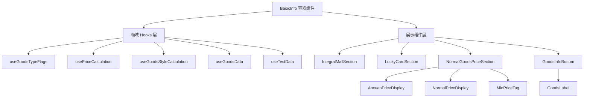
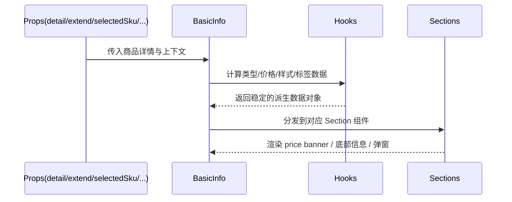

# 商品详情 BasicInfo 组件拆分与性能优化技术方案

> 适用范围：Taro + React（微信小程序/多端）
>
> 本方案整合两部分：
> 1) 基于业务边界的组件拆分（提升可维护性/可测性，目标单文件 ≤ 300 行）；
> 2) 基于 Vercel React Best Practices 的性能实践对照（重点：bundle 与重渲染优化）。

## 1. 背景与目标

## 1.1 背景：

<mark>BasicInfo</mark> 组件当前代码规模约 1400+ 行，包含“价格计算、营销氛围、标签规则、优惠券入口、会员引导、跨境税费、众筹分期”等多业务场景与多套 UI 分支（积分商城/福卡/安选/团购/众筹/普通）。现状带来的问题：

- 维护成本高：需求改动容易牵一发而动全身，回归范围大。
- 可测性差：逻辑与 UI 绑定在同一个组件内，难以做单元测试（纯逻辑不可直接测、需要完整渲染上下文）。
- 性能风险：大量 useMemo/useCallback 依赖对象引用，存在不必要的重新计算；同时存在 barrel import 风险（包体与加载性能）。

## 1.2 目标：

通过“按业务边界拆分 + React 性能实践落地”，把 `BasicInfo` 重构为可维护、可测试、性能更稳定的结构：

| **目标类型** | **具体目标描述** | **衡量指标（量化目标）** | **预期收益** | **验收标准** |
| -------- | ---------- | -------------- | -------- | -------- |
| 可维护性 | 拆分为“容器组件 + 领域 hooks + 展示组件” | 单文件最大行数 ≤ 300；目录结构清晰 | 改动影响面可控、Review 更快 | 代码结构按目录约束落地，原有功能不变 |
| 可测性 | 核心价格/样式/标签等逻辑可单测 | hooks/纯函数可被直接 import 测试 | 单测接入成本下降 | 新增至少 10 个核心逻辑单测（后续阶段完成） |
| 性能 | 规避不必要重渲染与重复计算 | useMemo/useCallback 依赖项以原始类型为主；减少对象依赖 | 交互时卡顿风险下降 | 对比前后交互无明显退化；关键 memo 组件命中率提升（手工验证） |
| 包体 | 降低 bundle 体积风险 | 避免 barrel import；可选的懒加载（按 Taro 支持程度） | 首包更小、加载更快 | 依赖导入方式调整完成；打包产物体积不增加 |
| 兼容性 | 对外 Props/API 与视觉保持一致 | `BasicInfo` 对外 Props 不变；CSS className 不变 | 零业务方改造成本 | 现网页面展示一致、功能一致 |

## 2.  架构设计

### 2.1 设计思路

==本方案采用“领域逻辑下沉 + UI 分支拆分 + 容器组件编排”的方式，依据如下：==

1) **业务边界清晰可切**：代码中存在天然分支（积分商城/福卡/普通商品 price banner），且每个分支的 UI 与数据依赖相对独立。

2) **将不可测的 UI 混杂逻辑变为可测的领域逻辑**：把价格计算、背景/氛围规则、标签生成等提取为 hooks/纯函数，形成可单测入口。

3) **遵循 Vercel React Best Practices 的关键点（适配 Taro）**：
- `bundle-barrel-imports`：避免 barrel import，降低包体风险。
- `rerender-memo` / `rerender-dependencies`：将昂贵计算放入 memo 组件或 hooks，并用原始类型依赖，减少不必要重算。
- `js-set-map-lookups` / `js-combine-iterations`：对多次判断与多次遍历做 Set/单次循环优化。

4) **保持外部接口不变**：拆分只在组件内部组织结构变化，对外 Props 不变，样式类名与布局保持一致。

### 2.2 实现架构图与流程图

#### 2.2.1 组件分层架构



#### 2.2.2 数据流与渲染流程（简化）



## 3. 技术选型

拆分与优化遵循“尽量不引入新依赖”的原则，优先使用现有栈能力：

| **技术/框架** | **选型理由** | **替代方案** | **局限性/风险** | **应对策略** | **使用范围** |
| --------- | -------- | -------- | ---------- | -------- | -------- |
| React（函数组件 + hooks） | 与现有代码一致，利于抽离领域 hooks | class component | hooks 依赖项不当易引发重算 | 依赖项以原始类型为主，必要时拆纯函数 | 全量 |
| Taro 组件体系（`Show` 等） | 适配小程序生态，减少兼容性问题 | 原生条件渲染 | `Show` 语义与 React 条件渲染不同 | 保持现有风格，避免大面积重写 | UI 渲染 |
| TypeScript | 类型约束提升重构安全性 | JavaScript | 类型复杂/泛型繁琐 | 统一定义 types，边界处做收敛 | hooks/组件 props |
| Vercel React Best Practices | 提供可执行的性能规则集合 | 仅靠经验 | 部分 Next.js/SSR 规则不适用 Taro | 仅落地与客户端渲染相关的规则（bundle/rerender/js） | 性能治理 |
| 动态导入（可选） | 按需加载重组件，降低首包 | 全量静态导入 | 小程序侧动态导入支持受构建配置影响 | 作为可选项：先做导入直达；动态导入需验证产物 | 低频组件（弹窗/众筹） |

## 4. 实现方案

本节给出“拆分结构 + 关键逻辑下沉 + 性能规则落地”的一体化方案。

### 4.1 拆分后的目录结构（目标：单文件 ≤ 300 行）

```
src/subpackages/goods/Detail/components/BasicInfo/
├── index.tsx                       # 容器组件：状态/编排/出口（≤200行）
├── types.ts                        # 对内类型收敛（≤120行）
├── constants.ts                    # Set/Map 常量（≤120行）
├── hooks/
│   ├── useGoodsTypeFlags.ts        # 商品类型/身份判断（≤150行）
│   ├── useGoodsData.ts             # 时间、福卡聚合等（≤250行）
│   ├── usePriceCalculation.ts      # 价格/积分/佣金（≤300行）
│   └── useGoodsStyleCalculation.ts # 氛围背景/文案/样式（≤300行）
└── components/
    ├── IntegralMallSection/index.tsx        # 积分商城 price banner（≤250行）
    ├── LuckyCardSection/index.tsx           # 福卡商城 price banner（≤300行）
    ├── NormalGoodsPriceSection/
    │   ├── index.tsx                        # 普通商品 price banner（≤250行）
    │   ├── AnxuanPriceDisplay.tsx           # 安选/团购价格展示（≤250行）
    │   ├── NormalPriceDisplay.tsx           # 普通价格展示（≤200行）
    │   └── MinPriceTag.tsx                  # 最低到手价标签（≤200行）
    └── GoodsInfoBottom/
        ├── index.tsx                        # 底部：券/活动入口/名称卖点（≤300行）
        └── GoodsLabel.tsx                   # 标签计算独立 memo 组件（≤250行）
```

### 4.2 领域逻辑抽离与边界划分

#### 4.2.1 `useGoodsTypeFlags`：集中管理“类型/身份”的派生布尔值

- 输入：`detail`、`refreshTime`、当前用户/店铺状态
- 输出：`isLuckyCardGoods/isCrowdfundingGoods/isAnxuanGoods/isGroupBuyGoods/isVip/...`
- 目的：减少散落的判断逻辑，UI 组件只依赖 flags。

#### 4.2.2 `usePriceCalculation`：价格/会员价/积分/佣金等计算下沉

- 将 `prices`、`memberPrices`、`getMinPriceBySku`、`skuIntegralNum`、`skuThirdPartyCommission` 等聚合。
- 对“安选/团购/直播专属价/最低单价”等分支进行封装，UI 只拿结果展示。
- 可选：将复杂分支中的纯计算抽为纯函数，便于单测。

#### 4.2.3 `useGoodsStyleCalculation`：氛围背景与样式策略下沉

- 将 `getDetailBeautyImgByDesc`、`getDescTextImgByDesc`、`goodsStyle` 聚合。
- 明确“首单 > 自定义 > 定时上下架 > 普通”等优先级，保证逻辑集中。

#### 4.2.4 `useGoodsData`：时间状态/福卡数据/众筹分期与轻量解析聚合

- `goodsTimeState/startTime/endTime` 与 `CrowdfundingTimeline` 的 `installmentPaymentList` 计算
- 福卡兑换条件与标题所需的纯数据（建议一次遍历同时产出 total + condition parts，避免 filter+map+reduce 多次迭代）
- `channelSpuJson` 的安全解析（`try/catch`），防止脏数据导致页面崩溃
- 边界更正：`useGoodsData` 只返回可复用的“数据结果”，不返回 JSX；标签渲染仍由 `GoodsLabel`/容器组件承载（memo）

### 4.3 性能最佳实践落地清单（适配 Taro）

#### 4.3.1 Bundle 方向（CRITICAL）

1) **避免 barrel imports**（`bundle-barrel-imports`）

- 问题：`import { Icon, Show } from 'fq-mall-taro-components'` 可能引入不必要代码。
- 方案：优先替换为“直达路径”导入（以库实际导出结构为准）。

2) **动态导入（可选，需验证）**（`bundle-dynamic-imports`）

- 目标组件：`TaxationModal`、`ActivityRuleModal`、`CrowdfundingTimeline` 等“低频/重组件”。
- 方案：在 Taro 构建链路确认支持 `import()` 后，再引入 `React.lazy + Suspense` 或条件 import。

#### 4.3.2 重渲染方向（MEDIUM）

1) **依赖项用原始类型**（`rerender-dependencies`）

- 原则：避免把 `detail`、`selectedSku` 这类对象作为依赖整体传入。
- 做法：只依赖实际读取的字段（如 `detail?.minPrice`、`selectedSku?.price`）。

2) **昂贵渲染拆成 memo 子组件**（`rerender-memo`）

- 如：`GoodsLabel`、`AnxuanPriceDisplay`、`MinPriceTag`。
- 目的：把重逻辑/重渲染局部化，减少主容器 re-render 影响面。

3) **简单表达式不滥用 useMemo**（`rerender-simple-expression-in-memo`）

- 如 `selectedSku?.integral ?? detail?.integral` 直接计算即可。

#### 4.3.3 JS 方向（LOW-MEDIUM）

1) **Set/Map 优化多次判断**（`js-set-map-lookups`）

- 如：价格类型集合、bizSource 集合等，放入 `constants.ts`。

2) **合并多次迭代**（`js-combine-iterations`）

- 福卡条件与数量聚合可一次循环完成。

### 4.4 迁移策略（分阶段、可回滚）

#### Phase 0（优先级最高）：导入治理与性能基线（1-2 天）

- 导入方式从 barrel 调整为直达（以真实路径为准）
- 记录当前包体/首屏性能基线（用于对比）

#### Phase 1：抽离 hooks（2-3 天）

- 提取 `useGoodsTypeFlags/usePriceCalculation/useGoodsStyleCalculation/useGoodsData`
- 保持 UI 不变，仅替换数据来源

#### Phase 2：拆分 UI 组件（3-4 天）

- 拆 `IntegralMallSection/LuckyCardSection/NormalGoodsPriceSection/GoodsInfoBottom`
- 抽 `GoodsLabel` 为 memo 组件

#### Phase 3：性能细化与单测接入（2-3 天）

- 优化 memo 依赖项为原始字段
- 增加核心纯函数/ hooks 单测（不强制在本次重构同 PR 完成，可作为后续任务）

## 5. 性能与安全保障

**性能优化方向**：

- Bundle：避免 barrel import；对低频重组件采用可选懒加载（需先验证 Taro 构建产物）。
- Re-render：将高频/昂贵模块拆为 memo 组件；useMemo/useCallback 依赖收敛为原始字段；避免在简单表达式上使用 useMemo。
- JS：Set/Map 加速判断；合并多次迭代；必要时缓存频繁使用的对象字段。

**安全保障方向**：

- 逻辑迁移保持“纯重构”：不改变对外接口与业务逻辑输出。
- 对 `channelSpuJson` 的 `JSON.parse` 建议在抽离逻辑时增加容错（try/catch 或校验），避免脏数据导致页面崩溃。

## 6. 部署与监控

- 发布策略：分阶段合并，优先落地导入治理与 hooks 抽离，降低回归风险。
- 监控建议：
  - 关注商品详情页关键交互（切换 SKU、打开优惠券、打开税费说明）是否出现卡顿/报错。
  - 关注包体/分包大小变化（构建产物对比）。

## 7. 风险评估与备选方案

- 风险 1：导入直达路径不稳定/库不支持直达
  - 应对：以实际组件库导出结构为准；如果无法直达，则优先保证“拆分与可测性”，bundle 优化作为后续任务。

- 风险 2：Taro 小程序侧动态导入不符合预期
  - 应对：动态导入作为可选项；先做拆分与依赖收敛；懒加载需通过打包验证后再启用。

- 风险 3：重构导致细节回归（尤其价格/标签规则）
  - 应对：Phase 1 先抽逻辑不拆 UI；Phase 2 再拆 UI；关键逻辑引入单测与对照用例。

## 8. 版本演进计划（如从v1→v2）

- v1（可维护性优先）：完成 hooks 抽离 + UI 拆分，确保单文件 ≤ 300。
- v2（可测性增强）：为核心领域逻辑（价格、标签、氛围）补齐单测与回归用例。
- v3（性能精细化）：在验证通过后引入可选懒加载与更细粒度 memo 优化。

## 9.  版本兼容

- 对外 Props：`BasicInfo` 的 Props 与 `connectContext` 用法保持不变。
- 样式：保留现有 `index.scss` 与 className（避免 UI 回归）。
- 行为：优惠券弹层、税费弹层、会员引导、活动入口等交互保持一致。

