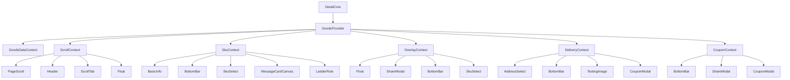
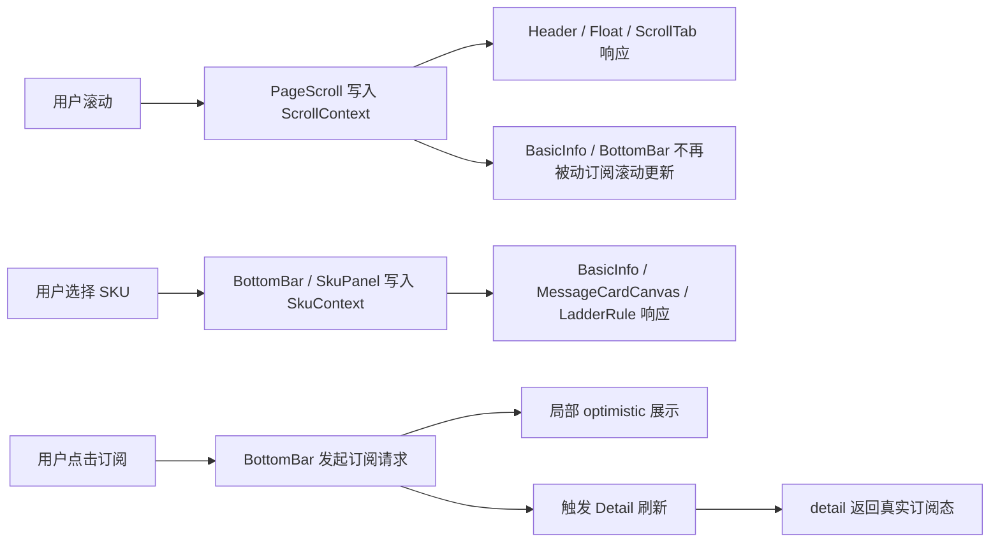

# 1. 背景与目标

## 1.1 背景：

Detail 页面长期由 GoodsStateContext 与 PageStateContext 混合承载商品、滚动、SKU、弹层、配送、优惠券等多类状态，导致高频滚动更新与低频业务状态相互干扰，重渲染扩散到非滚动组件；同时订阅相关展示与交互逻辑集中在 BottomBar，状态归属与职责边界不清。本次重构将围绕状态分层与 Context 粒度优化，降低渲染开销并提升可维护性。

## 1.2 目标：

本次优化目标不是单纯“拆 Context”，而是建立符合状态更新频率与业务边界的 Detail 页面状态分层模型，降低重渲染成本，并为后续订阅逻辑与页面交互逻辑解耦打基础。

| **目标类型** | **具体目标描述** | **衡量指标（量化目标）** | **预期收益** | **验收标准** |
| -------- | ---------- | -------------- | -------- | -------- |
| 性能优化 | 将高频滚动状态从通用大 Context 中拆出 | 滚动过程中非滚动相关组件渲染次数显著下降 | 降低滚动卡顿风险，减少无效渲染 | PageScroll、Header、Float、ScrollTab 独立订阅滚动域 |
| 架构优化 | 将页面状态按业务域拆为多个细粒度 Context | Page 状态不再由单一大对象承载 | 状态边界更清晰，后续维护成本下降 | 形成 Scroll、Sku、Overlay、Delivery、Coupon 等独立状态域 |
| 状态治理 | 明确订阅相关状态是否进入 Context | 避免双状态源和状态同步问题 | 提升交互一致性，降低订阅逻辑复杂度 | 订阅真实态仍由 detail 驱动，局部交互态按需管理 |
| 可维护性 | 收敛 Context 消费方式与派生逻辑 | 减少组件直接依赖大 Context | 降低组件耦合与重构成本 | 形成统一 hooks 访问模式与后续迁移路径 |

# 2.  架构设计

### 2.1 设计思路

本方案遵循以下设计原则：

1. 高频状态与低频状态分离，避免高频广播。
2. 同一更新节奏、同一消费域的状态归到同一 Context。
3. 真实业务数据保持单一事实源，避免重复存储。
4. 派生状态优先通过 Hook 计算，不优先落入全局 Context。

基于 Detail 页面当前消费关系，建议将现有状态拆分为以下六类：

1. GoodsDataContext：商品详情主数据域。
2. ScrollContext：滚动与锚点定位域。
3. SkuContext：SKU 选择及价格派生域。
4. OverlayContext：分享弹层、SKU 面板等短生命周期 UI 域。
5. DeliveryContext：地址与配送可达性域。
6. CouponContext：商品优惠券与省钱券勾选域。

其中，GoodsDataContext 继续作为商品详情的真实数据源，订阅相关字段仍归属于 detail，不额外抽出 SubscribeContext。原因如下：

1. isSubscribe、activityShowSubNum、isStockSubscribe、stockSubscribeNum、crowdfundingCanBuyStatus 等字段本质属于商品详情数据。
2. 这些字段跨组件共享时，本质上依赖的是 detail 的服务端返回，而不是页面临时态。
3. 如果再增加 SubscribeContext，会形成 detail 与 subscribeState 的双状态源，带来刷新同步、乐观回滚、埋点一致性等额外复杂度。

因此，订阅状态策略定义为：

1. 订阅真实态继续由 detail 承载。
2. 订阅展示逻辑通过 useSubscribeViewState 一类派生 Hook 收敛。
3. 若需要即时交互反馈，仅在 BottomBar 内维护局部 optimistic 状态，不进入全局 Context。

### 2.2 实现架构图与流程图

# 3. 技术选型

本次方案优先使用当前项目已有技术栈完成，不引入额外状态管理依赖，避免为单页面重构带来额外学习与迁移成本。

| **技术/框架** | **选型理由** | **替代方案** | **局限性/风险** | **应对策略** | **使用范围** |
| --------- | -------- | -------- | ---------- | -------- | -------- |
| React Context 多 Provider 拆分 | 无额外依赖，和现有 Detail 架构兼容 | use-context-selector、zustand | 仍需手动控制消费粒度 | 通过状态域拆分和 Hook 封装降低广播范围 | Detail 页面内部状态管理 |
| 自定义 Hook 派生状态 | 让派生逻辑从组件 JSX 中抽离，便于复用 | 继续在组件内 useMemo | Hook 数量增加 | 统一命名和职责边界 | SKU 价格态、订阅按钮态 |
| detail 作为订阅真实态单一来源 | 避免双状态源带来的同步复杂度 | 新增 SubscribeContext | 交互即时反馈需要补局部态 | 使用局部 optimistic 状态补足体验 | BottomBar 订阅交互 |
| 分阶段迁移策略 | 降低大规模一次性重构风险 | 一次性全量迁移 | 周期较长 | 先高收益后收口 | Detail 组件迁移 |

# 4. 实现方案

改造前 Detail 的 Context 使用现状可以概括为“商品数据已拆分，但页面交互状态仍过于集中”。GoodsStateContext 粒度相对合理，而 PageStateContext 同时承载了滚动、SKU、配送、弹层、优惠券等多个状态域，已经超出单一 Context 的合理边界。

## 4.1 现状分析

### 4.1.1 Context 使用现状

改造前 PageStateContext 包含以下状态：

1. 滚动域：scrollTop、scrollViewId、scrollIntoTop。
2. SKU 域：selectedSku、selectedSkuPromotionInfo、selectSkuProps。
3. 弹层域：showLoading、showShareModal、showSkuPanel。
4. 配送域：addressId、noDelivery、isAnxuanWithoutShopId。
5. 优惠券域：goodsAvailableCoupons、checkRepurchaseCoupon。

这些字段虽然都属于“页面状态”，但它们的更新频率与消费范围完全不同：

1. scrollTop 为高频写入状态。
2. selectedSku 及其衍生价格态在 SKU 选择时更新。
3. showShareModal、showSkuPanel 属于短生命周期 UI 状态。
4. addressId、noDelivery 属于配送业务状态。
5. goodsAvailableCoupons、checkRepurchaseCoupon 属于优惠券业务状态。

### 4.1.2 核心问题

#### 问题一：滚动高频写入会放大 Context 广播影响

PageScroll 在滚动中持续写入 scrollTop，如果滚动状态与业务状态共用同一 Context，则所有 usePageStateContext 消费者都可能被动进入更新链。即使部分组件最终未发生 DOM 变化，也会增加 render 和计算成本。

#### 问题二：同一 Context 内状态职责混杂

改造前 PageStateContext 既承担页面交互协调职责，又承担业务数据中间态职责，导致：

1. 组件难以判断自己真正依赖的是哪一类状态。
2. 后续重构时容易误伤无关组件。
3. 组件 Props 与 Context 的映射层不稳定，难以按业务域迁移。

#### 问题三：订阅逻辑集中但状态来源未抽象

BottomBar 中同时处理商品上下架提醒、库存补货提醒、阶梯团购提醒、众筹预约等逻辑。当前设计虽然没有多份状态源，但展示判断、请求分发、成功提示、埋点、刷新逻辑都耦合在同一组件内，维护成本较高。

## 4.2 更细粒度 Context 拆分方案

### 4.2.1 GoodsDataContext

承载字段：

1. detail
2. extend
3. content
4. spuId
5. refreshTime
6. noGoods
7. noStock
8. minLiveExclusiveSku
9. communityGroupId
10. isShowDailyPage

职责：

1. 作为 Detail 页面商品主数据事实源。
2. 继续承接订阅真实态字段。
3. 为 BottomBar、BasicInfo、ShareModal、AddressSelect 等组件提供底层商品信息。

### 4.2.2 ScrollContext

承载字段：

1. scrollTop
2. scrollViewId
3. scrollIntoTop

职责：

1. 承接页面滚动与锚点控制。
2. 仅服务滚动相关组件。
3. 隔离高频状态，避免其扩散到 SKU、订阅、优惠券等域。

直接收益：

1. PageScroll、Header、ScrollTab、Float 独立订阅。
2. BottomBar、BasicInfo、CouponModal 等不再被动承接滚动更新。

### 4.2.3 SkuContext

承载字段：

1. selectedSku
2. selectSkuProps
3. selectedSkuPromotionInfo

职责：

1. 统一 SKU 选择结果与其价格派生态。
2. 服务 BasicInfo、BottomBar、SkuSelect、MessageCardCanvas、LadderRule、LadderActive 等组件。

优化建议：

selectedSkuPromotionInfo 中长期建议由“存储态”转为“派生态 Hook”，减少 selectedSku 与优惠券变化时的同步更新成本。

### 4.2.4 OverlayContext

承载字段：

1. showShareModal
2. showSkuPanel

职责：

1. 管理短生命周期 UI 弹层显隐。
2. 让分享链路与 SKU 面板链路不再依赖通用大 Context。

### 4.2.5 DeliveryContext

承载字段：

1. addressId
2. noDelivery
3. isAnxuanWithoutShopId

职责：

1. 管理地址选择和配送可达性。
2. 为 AddressSelect、BottomBar、CouponModal、TestingImage 提供配送相关信息。

### 4.2.6 CouponContext

承载字段：

1. goodsAvailableCoupons
2. checkRepurchaseCoupon

职责：

1. 管理商品优惠券结果与省钱券勾选状态。
2. 为 BottomBar、ShareModal、CouponModal 提供优惠券相关状态。

## 4.3 订阅相关状态归属方案

### 4.3.1 是否单独放入 Context

结论：不单独新增 SubscribeContext。

### 4.3.2 原因说明

1. 订阅状态本质属于商品业务数据，应继续由 detail 承载。
2. 多数订阅展示逻辑依赖商品详情返回值，而不是页面临时交互态。
3. 新增 SubscribeContext 会导致 detail 与 subscribeState 之间的双写与同步问题。
4. 当前问题不在于“订阅状态没有 Context”，而在于“订阅逻辑未抽象，展示判断与请求逻辑耦合”。

### 4.3.3 推荐改造方式

1. 保持 detail 为订阅真实态单一来源。
2. 将 BottomBar 中订阅相关判断抽离为 useSubscribeViewState Hook。
3. 将订阅请求分发逻辑抽离为 useSubscribeActions Hook。
4. 如果需要即时 UI 反馈，在 BottomBar 内维护局部 optimistic 状态，成功后刷新 detail，失败时回滚。

## 4.4 分阶段实施方案

### 阶段一：高收益拆分

实施内容：

1. 拆出 ScrollContext。
2. 迁移 PageScroll、Header、ScrollTab、Float 到 ScrollContext。
3. 保持其他状态域不变，优先拿到重渲染收益。

收益：

1. 风险最低。
2. 可直接缓解滚动场景性能问题。

### 阶段二：业务域拆分

实施内容：

1. 拆出 SkuContext、OverlayContext、DeliveryContext、CouponContext。
2. 迁移 BottomBar、BasicInfo、SkuSelect、ShareModal、CouponModal、AddressSelect 等消费者。

收益：

1. 组件依赖边界清晰。
2. 状态更新影响面可控。

### 阶段三：订阅与派生逻辑收口

实施内容：

1. 抽离 useSubscribeViewState。
2. 抽离 useSubscribeActions。
3. 评估 selectedSkuPromotionInfo 从存储态转派生态。

收益：

1. BottomBar 复杂度下降。
2. 订阅逻辑可复用、可测试。

## 4.5 当前落地状态（2026-04-03）

当前代码已完成以下事项：

1. 已拆分并上线：ScrollContext、SkuContext、OverlayContext、DeliveryContext、CouponContext。
2. PageContext 空壳已移除，`usePageStateContext` 与 `PageStateContext` 不再存在于 Detail 业务代码。
3. OverlayContext 当前仅承载 `showShareModal`、`showSkuPanel`。
4. CouponContext 承载 `goodsAvailableCoupons`、`checkRepurchaseCoupon`，并已迁移 BottomBar、ShareModal、Float、CouponTag、CouponModal 等消费方。
5. DeliveryContext 承载 `addressId`、`noDelivery`、`isAnxuanWithoutShopId`，并已迁移 AddressSelect、BottomBar、SkuSelect、LadderProgressBar、TestingImage、CouponModal 等消费方。

后续建议：

1. 把订阅展示判断和订阅动作继续从 BottomBar 抽离为独立 Hook。
2. 在小程序环境补齐渲染次数对比与关键交互回归数据。

# 5. 性能与安全保障

**性能优化方向**：

1. 优先拆出 ScrollContext，切断高频滚动状态对大多数业务组件的更新影响。
2. 按业务域拆分 Context，降低单次状态变更的广播半径。
3. 派生数据尽量通过 Hook 计算，减少冗余 setState 与同步逻辑。
4. 收敛 BottomBar 中的订阅逻辑与按钮派生逻辑，减少重复计算与重复判断。

**安全保障方向**：

1. 订阅真实态仍以服务端返回 detail 为准，避免本地状态与服务端结果不一致。
2. optimistic 状态仅做短暂 UI 反馈，不作为持久状态源。
3. 埋点事件、接口入参与提示文案在重构中保持现有语义不变。
4. Context 拆分采用分阶段实施，避免一次性大改造成难以定位的问题。

# 6. 部署与监控

建议补充以下监控与验证项：

1. Detail 页面滚动流畅度和主线程耗时变化。
2. BottomBar 按钮点击响应是否有回归。
3. 订阅成功率、失败率、刷新成功率。
4. goods_subscribe、subscribe_messages 等核心埋点是否保持一致。
5. 分享弹层、SKU 面板、地址弹层交互是否正常。

若支持灰度，可按 Detail 页面维度逐步放量，并重点观察高频滚动链路和订阅交互链路。

# 7. 风险评估与备选方案

主要风险如下：

1. Context 拆分过程中，消费者可能漏迁移，导致状态读取错误。
2. 部分组件同时依赖多个状态域，迁移时可能出现依赖遗漏。
3. BottomBar 订阅逻辑抽离时，如果 optimistic 状态设计不当，可能造成短暂展示不一致。

应对策略如下：

1. 先按消费清单完成字段归类后再分批迁移。
2. 先拆 ScrollContext，再拆业务域 Context，避免一次性改动过大。
3. 订阅真实态不迁出 detail，降低行为回归风险。

备选方案：

若阶段二改造成本超预期，可至少保留阶段一成果，即先完成 ScrollContext 拆分，优先拿到性能收益，再逐步推进业务域拆分。

# 8. 版本演进计划（如从v1→v2）

v1：

1. 拆出 ScrollContext。
2. 保持 detail 作为订阅真实态。
3. 初步收敛滚动相关消费者。

v2：

1. 完成 SkuContext、OverlayContext、DeliveryContext、CouponContext 拆分。
2. 批量迁移消费者。

v3：

1. 抽离订阅视图逻辑与订阅动作逻辑。
2. 评估 selectedSkuPromotionInfo 派生化。

# 9.  版本兼容

1. 本方案仅调整 Detail 页面内部状态组织方式，不变更页面对外路由、接口协议和主要交互语义。
2. 订阅相关真实字段仍来自商品详情接口，不影响服务端协议。
3. 若按阶段实施，可在每个阶段保持现有功能外部行为兼容。
4. 方案支持先文档评审、后小步实施，便于逐阶段验证与回滚。

## 目录

- ### [Get Started](#GetStarted)

- ### [技术栈](#Technology)

- ### [发版记录](#ReleaseHistory)

- ### [Src子目录](#SrcDir)

- ### [开发规范](#CodeRule) 
